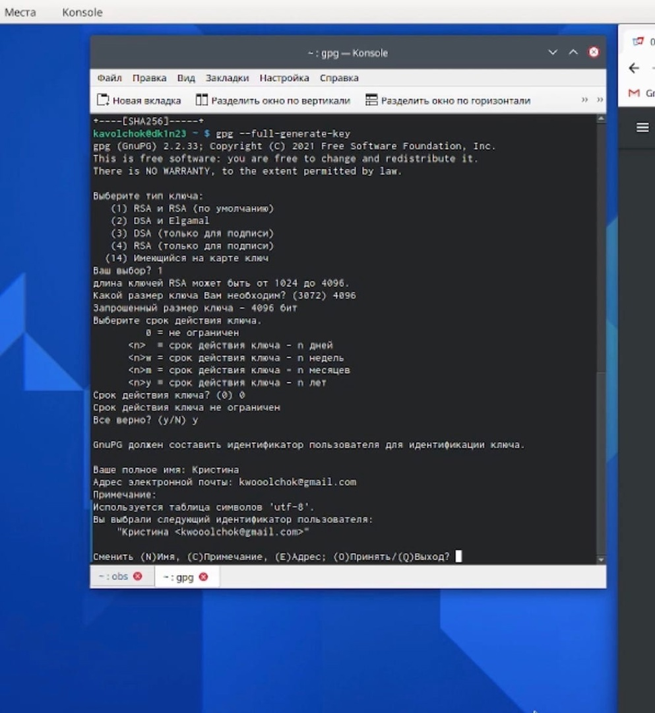
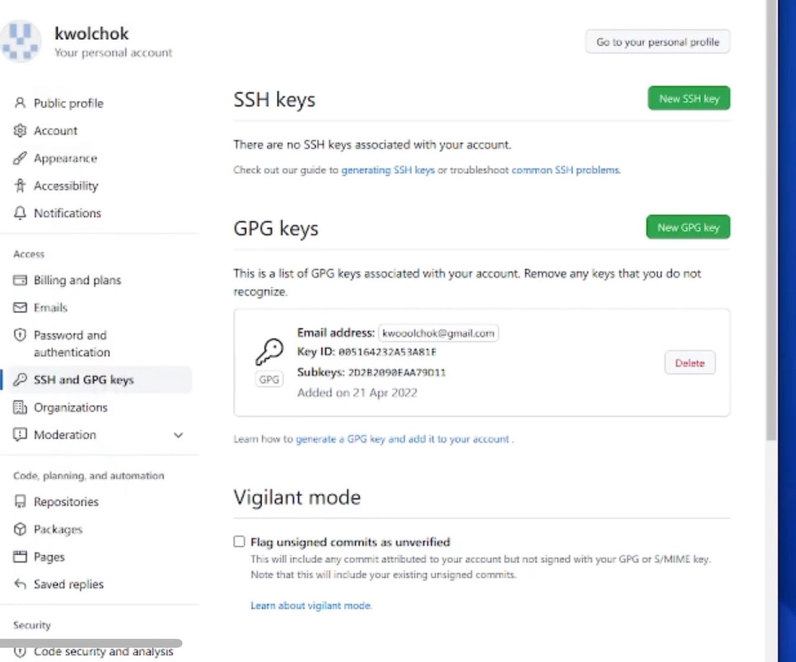

---
## Front matter
title: "Отчет по лабораторной работе №3"
subtitle: "Дисциплина: Операционные системы"
author: "Волчок Кристина Александровна"

## Generic otions
lang: ru-RU

## Bibliography
bibliography: bib/cite.bib
csl: pandoc/csl/gost-r-7-0-5-2008-numeric.csl

## Pdf output format
toc: true # Table of contents
toc-depth: 2
lof: true # List of figures
#lot: true # List of tables
fontsize: 12pt
linestretch: 1.5
papersize: a4
documentclass: scrreprt
## I18n polyglossia
polyglossia-lang:
  name: russian
  options:
	- spelling=modern
	- babelshorthands=true
polyglossia-otherlangs:
  name: english
## I18n babel
babel-lang: russian
babel-otherlangs: english
## Fonts
mainfont: PT Serif
romanfont: PT Serif
sansfont: PT Sans
monofont: PT Mono
mainfontoptions: Ligatures=TeX
romanfontoptions: Ligatures=TeX
sansfontoptions: Ligatures=TeX,Scale=MatchLowercase
monofontoptions: Scale=MatchLowercase,Scale=0.9
## Biblatex
biblatex: true
biblio-style: "gost-numeric"
biblatexoptions:
  - parentracker=true
  - backend=biber
  - hyperref=auto
  - language=auto
  - autolang=other*
  - citestyle=gost-numeric

## Misc options
indent: true
header-includes:
  - \usepackage{indentfirst}
  - \usepackage{float} # keep figures where there are in the text
  - \floatplacement{figure}{H} # keep figures where there are in the text
---

# Цель работы
В ходе выполнения лабораторной работы я должна изучить идеологию и применение средств контроля версий, а также освоить умения по работе с git.

# Выполнение лабораторной работы

1. Заходим и создаем  учётную запись на https://github.com. Далее заполняем основные данные на https://github.com. (рис.1)

{ #fig:001 width=70% }

2. Далее начинаем базовую настройку git.(рис.2)
Зададим имя и email владельца репозитория (Kristina Volchok):

{ #fig:001 width=70% }

3. Настроим utf-8 в выводе сообщений git(рис.2):

{ #fig:001 width=70% }

4. Настроим верификацию и подписание коммитов git и зададим имя начальной ветки (будем называть её master):(рис.3)

{ #fig:001 width=70% }

5. Параметр autocrlf и параметр safecrlf делали вручную т. к. консоль не грузилась (рис.4):

{ #fig:001 width=70% }

6. После создаем ключи ssh по алгоритму rsa с ключём размером 4096 бит(рис.5):

{ #fig:001 width=70% }

7. Генерируем ключ(рис.6):

{ #fig:001 width=70% }

8. Выводим список ключей и копируем отпечаток приватного ключа (Отпечаток ключа — это последовательность байтов, используемая для идентификации более длинного, по сравнению с самим отпечатком ключа.):Выводим список ключей и копируем отпечаток приватного ключа (Отпечаток ключа — это последовательность байтов, используемая для идентификации более длинного, по сравнению с самим отпечатком ключа.): (рис.7)

{ #fig:001 width=70% }

9. Копируем наш ключ и переходим в настройки GitHub (https://github.com/settings/keys), нажмите на кнопку New GPG key и вставляем полученный ключ в поле ввода.На этом же этапе добавляем SSH ключ из буфера обмена(рис.8).

{ #fig:001 width=70% }

10. Настройка автоматических подписей коммитов git
Используя введёный email, указываем Git применяем его при подписи коммитов(рис.10):

{ #fig:001 width=70% }

11. Позже для настройка gh мы авторизовываемся  через браузер и переходим  в каталог курса (cd os-intro)(рис.11).

{ #fig:001 width=70% }

12. Удаляем лишние файлы(rm package.json)(рис.12):

{ #fig:001 width=70% }

13. Создаем необходимые каталоги (make COURSE=os-intro)(рис.13):

{ #fig:001 width=70% }

14. И после отправляем каталоги на сервер(-git add-git commit -am 'feat(main): make course structure -git push)(рис.14):

{ #fig:001 width=70% }

{ #fig:001 width=70% }

# Вывод
В ходе выполнения лабораторной работы я  изучила идеологию и применение средств контроля версий, а также освоила умения по работе с git.

# Контрольные вопросы
1. Что такое системы контроля версий (VCS) и для решения каких задач они предназначаются?
2. Объясните следующие понятия VCS и их отношения: хранилище, commit, история, рабочая копия.
3. Что представляют собой и чем отличаются централизованные и децентрализованные VCS? Приведите примеры VCS каждого вида.
4. Опишите действия с VCS при единоличной работе с хранилищем.
5. Опишите порядок работы с общим хранилищем VCS.
6. Каковы основные задачи, решаемые инструментальным средством git?
7. Назовите и дайте краткую характеристику командам git.
8. Приведите примеры использования при работе с локальным и удалённым репозиториями. 
9. Что такое и зачем могут быть нужны ветви (branches)? 
10. Как и зачем можно игнорировать некоторые файлы при commit?

1. Система контроля версий Git представляет собой набор программ командной строки. Доступ к ним можно получить из терминала посредством ввода команды git с различными опциями.
Системы контроля версий (Version Control System, VCS) применяются при работе нескольких человек над одним проектом. Обычно основное дерево проекта хранится в локальном или удалённом репозитории, к которому настроен доступ для участников проекта. При внесении изменений в содержание проекта система контроля версий позволяет их фиксировать, совмещать изменения, произведённые разными участниками проекта, производить откат к любой более ранней версии проекта, если это требуется.
2. В классических системах контроля версий используется централизованная модель, предполагающая наличие единого репозитория для хранения файлов. Выполнение большинства функций по управлению версиями осуществляется специальным сервером.Участник проекта (пользователь) перед началом работы посредством определённыхкоманд получает нужную ему версию файлов. После внесения изменений, пользователь размещает новую версию в хранилище. При этом предыдущие версии не удаляютсяиз центрального хранилища и к ним можно вернуться в любой момент. Сервер может сохранять неполную версию изменённых файлов, а производить так называемую дельта-компрессию—сохранять только изменения между последовательными версиями,чтопозволяет уменьшить объём хранимых данных.
Системы контроля версий также могут обеспечивать дополнительные, более гибкие функциональные возможности. Например,они могут поддерживать работу с нескольки-ми версиями одного файла,сохраняя общую историю изменений до точки ветвления версий и собственные истории изменений каждой ветви. Крометого, обычно доступна информация о том, кто из участников, когда и какие изменения вносил. Обычно такого рода информация хранится в журнале изменений, доступ к которому можно ограничить.
3. Централизованные системы — это системы, которые используют архитектуру клиент / сервер, где один или несколько клиентских узлов напрямую подключены к центральному серверу. Пример - Wikipedia.
В децентрализованных системах каждый узел принимает свое собственное решение. Конечное поведение системы является совокупностью решений отдельных узлов. Пример — Bitcoin.
4. В классических системах контроля версий используется централизованная модель, предполагающая наличие единого репозитория для хранения файлов. Выполнение большинства функций по управлению версиями осуществляется специальным сервером. Участник проекта (пользователь) перед началом работы посредством определённых команд получает нужную ему версию файлов. После внесения изменений, пользователь размещает новую версию в хранилище. При этом предыдущие версии не удаляются из центрального хранилища и к ним можно вернуться в любой момент. Сервер может сохранять не полную версию изменённых файлов, а производить так называемую дельтакомпрессию — сохранять только изменения между последовательными версиями, что позволяет уменьшить объём хранимых данных.
5. Системы контроля версий также могут обеспечивать дополнительные, более гибкие функциональные возможности. Например, они могут поддерживать работу с несколькими версиями одного файла, сохраняя общув ходе выполнения лабораторной работы я должна изучить идеологию и применение средств контроля версий, а также освоить умения по работе с git.ю историю изменений до точки ветвления версий и собственные истории изменений каждой ветви. Кроме того, обычно доступна информация о том, кто из участников, когда и какие изменения вносил. Обычно такого рода информация хранится в журнале изменений, доступ к которому можно ограничить.
6. У Git две основных задачи: первая — хранить информацию о всех изменениях в вашем коде, начиная с самой первой строчки, а вторая — обеспечение удобства командной работы над кодом.
7. Основные команды git:
Наиболее часто используемые команды git:
– создание основного дерева репозитория :git init
–получение обновлений (изменений) текущего дерева из центрального репозитория: git pull
–отправка всех произведённых изменений локального дерева в центральный репозиторий:git push
–просмотр списка изменённых файлов в текущей директории: git status
–просмотр текущих изменения: git diff
–сохранение текущих изменений:–добавить все изменённые и/или созданные файлы и/или каталоги: git add .
–добавить конкретные изменённые и/или созданные файлы и/или каталоги: git add имена_файлов 
– удалить файл и/или каталог из индекса репозитория (при этом файл и/или каталог остаётся в локальной директории): git rm имена_файлов
– сохранение добавленных изменений:
– сохранить все добавленные изменения и все изменённые файлы: git commit
-am 'Описание коммита'
–сохранить добавленные изменения с внесением комментария через встроенный редактор: git commit
–создание новой ветки, базирующейся на текущей: git checkout -b имя_ветки
–переключение на некоторую ветку: git checkout имя_ветки (при переключении на ветку, которой ещё нет в локальном репозитории, она будет создана и связана с удалённой) 
– отправка изменений конкретной ветки в центральный репозиторий: git push origin имя_ветки
–слияние ветки стекущим деревом:git merge —no-ff имя_ветки–удаление ветки: – удаление локальной уже слитой с основным деревом ветки:git branch 
-d имя_ветки–принудительное удаление локальной ветки: git branch 
-D имя_ветки–удаление ветки с центрального репозитория: git push origin :имя_ветки.
8. Использования git при работе с локальными репозиториями (добавления текстового документа в локальный репозиторий):
git add hello.txt
git commit -am 'Новый файл’
9. Проблемы, которые решают ветки git:
нужно постоянно создавать архивы с рабочим кодом
сложно "переключаться" между архивами
сложно перетаскивать изменев ходе выполнения лабораторной работы я должна изучить идеологию и применение средств контроля версий, а также освоить умения по работе с git.ния между архивами
легко что-то напутать или потерять
10. Во время работы над проектом так или иначе могут создаваться файлы, которые не требуется добавлять в последствии в репозиторий. Например, временные файлы, создаваемые редакторами, или объектные файлы, создаваемые компиляторами. Можно прописать шаблоны игнорируемых при добавлении в репозиторий типов файлов в файл.gitignore с помощью сервисов
      

::: {#refs}
:::
