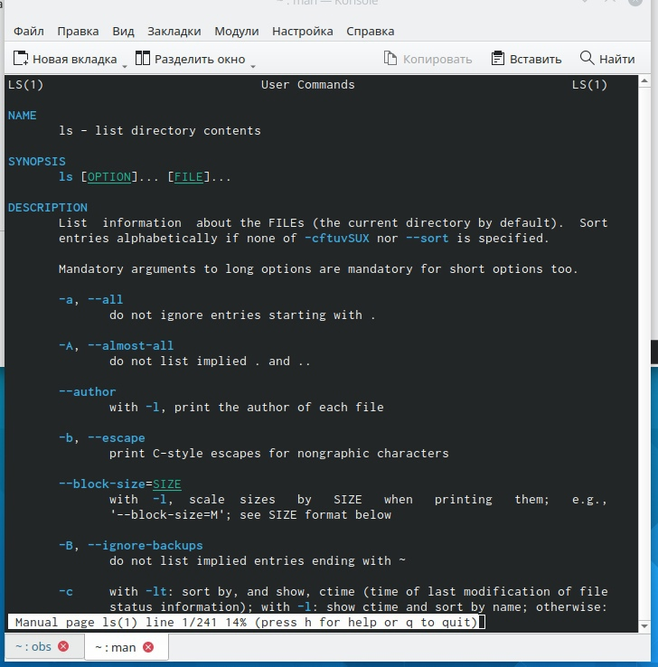

---
## Front matter
title: "Отчёт по лабораторной работе 4"
subtitle: "Дисциплина: Операционные системы"
author: "Волчок Кристина Александровна"

## Generic otions
lang: ru-RU
toc-title: "Содержание"

## Bibliography
bibliography: bib/cite.bib
csl: pandoc/csl/gost-r-7-0-5-2008-numeric.csl

## Pdf output format
toc: true # Table of contents
toc-depth: 2
lof: true # List of figures
lot: true # List of tables
fontsize: 12pt
linestretch: 1.5
papersize: a4
documentclass: scrreprt
## I18n polyglossia
polyglossia-lang:
  name: russian
  options:
	- spelling=modern
	- babelshorthands=true
polyglossia-otherlangs:
  name: english
## I18n babel
babel-lang: russian
babel-otherlangs: english
## Fonts
mainfont: PT Serif
romanfont: PT Serif
sansfont: PT Sans
monofont: PT Mono
mainfontoptions: Ligatures=TeX
romanfontoptions: Ligatures=TeX
sansfontoptions: Ligatures=TeX,Scale=MatchLowercase
monofontoptions: Scale=MatchLowercase,Scale=0.9
## Biblatex
biblatex: true
biblio-style: "gost-numeric"
biblatexoptions:
  - parentracker=true
  - backend=biber
  - hyperref=auto
  - language=auto
  - autolang=other*
  - citestyle=gost-numeric
## Pandoc-crossref LaTeX customization
figureTitle: "Рис."
tableTitle: "Таблица"
listingTitle: "Листинг"
lofTitle: "Список иллюстраций"
lotTitle: "Список таблиц"
lolTitle: "Листинги"
## Misc options
indent: true
header-includes:
  - \usepackage{indentfirst}
  - \usepackage{float} # keep figures where there are in the text
  - \floatplacement{figure}{H} # keep figures where there are in the text
---

# Цель работы

В ходе лабораторной работы мы должны приобрести практические навыки взаимодействия пользователя с системой посредством командной строки.

# Задание

1. Определить полное имя домашнего каталога. Далее относительно этого каталога будут выполняться последующие упражнения.
2. Выполнить следующие действия:
2.1. Перейти в каталог /tmp.
2.2. Вывести на экран содержимое каталога /tmp. Для этого используем команду ls
с различными опциями. 
2.3. Определить, есть ли в каталоге /var/spool подкаталог с именем cron?
2.4. Перейти в домашний каталог и вывести на экран его содержимое. Определить, кто является владельцем файлов и подкаталогов?
3. Выполнить следующие действия:
3.1. В домашнем каталоге создать новый каталог с именем newdir.
3.2. В каталоге ~/newdir создать новый каталог с именем morefun.
3.3. В домашнем каталоге создать одной командой три новых каталога с именами
letters, memos, misk. Затем удалить эти каталоги одной командой.
3.4. Попробовать удалить ранее созданный каталог ~/newdir командой rm. Проверить,
был ли каталог удалён.
3.5. Удалить каталог ~/newdir/morefun из домашнего каталога. Проверить, был ли
каталог удалён.
4. С помощью команды man определить, какую опцию команды ls нужно использовать для просмотра содержимое не только указанного каталога, но и подкаталогов,
входящих в него.
5. С помощью команды man определить набор опций команды ls, позволяющий отсортировать по времени последнего изменения выводимый список содержимого каталога
с развёрнутым описанием файлов.
6. Использовать команду man для просмотра описания следующих команд: cd, pwd, mkdir,
rmdir, rm. 
7. Использовать информацию, полученную при помощи команды history, выполнить модификацию и исполнение нескольких команд из буфера команд.

# Выполнение лабораторной работы
1. Определяем полное имя домашнего каталога с помощью команды pwd(рис.[-@fig:001]).

{ #fig:001 width=70% }

2. Рисунки [-@fig:002;-@fig:003] Переходим  в каталог /tmp и выводим на экран содержимое с помощью команды ls [-@fig:004].

{ #fig:002 width=70% }

{ #fig:003 width=70% }

{ #fig:004 width=70% }

 Определяем, есть ли в каталоге /var/spool подкаталог с именем cron(рис.[-@fig:005]).

{ #fig:005 width=70% }

 Переходим в домашний каталог и выводим на экран его содержимое. Определяем, кто является владельцем файлов и подкаталогов(рис.[-@fig:006]).

{ #fig:006 width=70% }

3. 3.1. В домашнем каталоге создаем новый каталог с именем newdir(рис.[-@fig:007]).

{ #fig:007 width=70% }

3.2. В каталоге ~/newdir создаем новый каталог с именем morefun(рис.[-@fig:008]).

{ #fig:008 width=70% }

3.3. В домашнем каталоге создаем одной командой три новых каталога с именами letters, memos, misk. Затем удаляем эти каталоги одной командой.(рис.[-@fig:009]).

{ #fig:009 width=70% }

3.4. Пробуем удалить ранее созданный каталог ~/newdir командой rm. Каталог не был удален (рис.[-@fig:010].

{ #fig:010 width=70% }

3.5. Удалияем каталог ~/newdir/morefun из домашнего каталога(рис.[-@fig:011]). С помощью команды rm -r.

{ #fig:011 width=70% }

4. С помощью команды man определяем, какую опцию команды ls нужно использовать для просмотра содержимого не только указанного каталога, но и подкаталогов,
входящих в него.(рис.[-@fig:012;-@fig:013])

{ #fig:012 width=70% }

{ #fig:013 width=70% }

5. С помощью команды man определяем набор опций команды ls, позволяющий отсортировать по времени последнего изменения выводимый список содержимого каталога
с развёрнутым описанием файлов(рис.[-@fig:014;-@fig:015]).

{ #fig:014 width=70% } 

{ #fig:015 width=70% }

6. Используем команду man для просмотра описания следующих команд: cd, pwd, mkdir,
rmdir, rm(рис[-@fig:016]).

{ #fig:016 width=70% }

Команда cd используется для перемещения по файловой системе операционной системы типа Linux. Команда cd (рис.[-@fig:017]):

{ #fig:017 width=70% }

Команда pwd используется для определения абсолютного пути к текущему каталогу.
Команда pwd (рис.[-@fig:018]):

{ #fig:018 width=70% }

Команда mkdir используется для создания каталогов.
Команда mkdir (рис.[-@fig:019]):

{ #fig:019 width=70% }

Для пустого каталога  можно использовать команду rmdir. Если удаляемый
каталог содержит файлы, то команда не будет выполнена — нужно использовать rm -
r имя_каталога. 
Команда rmdir (рис.[-@fig:020]):

{ #fig:020 width=70% }

Команда rm используется для удаления файлов и/или каталогов.
Команда rm (рис.[-@fig:021]):

{ #fig:021 width=70% }

7. Использовать информацию, полученную при помощи команды history, выполнить модификацию и исполнение нескольких команд из буфера команд(рис.[-@fig:022]).

{ #fig:022 width=70% }

Модификация(рис.[-@fig:023]):

{ #fig:023 width=70% }

Исполнение нескольких команд(рис.[-@fig:024]):

{ #fig:024 width=70% }

# Выводы

В ходе проделанной  лабораторной работы я приобрела практические навыки взаимодействия пользователя с системой посредством командной строки.

# Контрольные вопросы

1. Что такое командная строка?
2. При помощи какой команды можно определить абсолютный путь текущего каталога?
Приведите пример.
3. При помощи какой команды и каких опций можно определить только тип файлов
и их имена в текущем каталоге? Приведите примеры.
4. Каким образом отобразить информацию о скрытых файлах? Приведите примеры.
5. При помощи каких команд можно удалить файл и каталог? Можно ли это сделать
одной и той же командой? Приведите примеры.
6. Каким образом можно вывести информацию о последних выполненных пользователем командах? работы?
7. Как воспользоваться историей команд для их модифицированного выполнения? Приведите примеры.
8. Приведите примеры запуска нескольких команд в одной строке.
9. Дайте определение и приведите примера символов экранирования.
10. Охарактеризуйте вывод информации на экран после выполнения команды ls с опцией
l.
11. Что такое относительный путь к файлу? Приведите примеры использования относительного и абсолютного пути при выполнении какой-либо команды.
12. Как получить информацию об интересующей вас команде?
13. Какая клавиша или комбинация клавиш служит для автоматического дополнения
вводимых команд?

1) Командная строка – специальная программа, позволяющая управлять
операционной системой при помощи текстовых команд, вводимых в
окне приложения. Источник [@robachevsky:unix]
2) Для определения абсолютного пути к текущему каталогу используется
команда pwd (print working directory). Например, команда «pwd» в
моем домашнем каталоге выведет: /home/kavolchok
3)  Команда «ls -F» (или «ls -aF», тогда появятся еще скрытые файлы)
выведет имена файлов в текущем каталоге и их типы.
Тип каталога обозначается /, тип исполняемого файла обозначается *,
тип ссылки обозначается @. 
4) Имена скрытых файлов начинаются с точки. Эти файлы в
операционной системе скрыты от просмотра и обычно используются
для настройки рабочей среды. Для того, чтобы отобразить имена
скрытых файлов, необходимо использовать команду «ls –a».
5) Команда rm используется для удаления файлов и/или каталогов.
Команда rm -i выдает запрос подтверждения на удаление файла.
Команда rm -r необходима, чтобы удалить каталог, содержащий файлы.
Без указания этой опции команда не будет выполняться. Если каталог
пуст, то можно воспользоваться командой rmdir. Если удаляемый
каталог содержит файлы, то команда не будет выполнена – нужно
использовать «rm -r имя_каталога».
Таким образом, каталог, не содержащий файлов, можно удалить и
командой rm, и командой rmdir. Файл командой rmdir удалить нельзя.
6) Чтобы определить, какие команды выполнил пользователь в сеансе
работы, необходимо воспользоваться командой «history».
7) Чтобы исправить или запустить на выполнение команду, которую
пользователь уже использовал в сеансе работы, необходимо: в первом
случае: воспользоваться конструкцией
!<номер_команды>:s/<что_меняем>/<на_что_меняем>, во втором
случае: !<номер_команды>.
8) Чтобы записать в одной строке несколько команд, необходимо между
ними поставить ; . Например, «cd /tmp; ls».
9) Символ обратного слэша \ позволяет использовать управляющие
символы ( ".", "/", "$", "*", "[", "]", "^", "&") без их интерпретации
командной оболочкой; процедура добавления данного символа перед
управляющими символами называется экранированием символов.
Например, команда «ls newdir\/morefun» отобразит содержимое
каталога newdir/morefun.
10) Команда «ls -l» отображает список каталогов и файлов с подробной
информацией о них (тип файла, право доступа, число ссылок,
владелец, размер, дата последней ревизии, имя файла или каталога).
11) Полный, абсолютный путь от корня файловой системы – этот путь
начинается от корня "/" и описывает весь путь к файлу или каталогу;
Относительный путь – это путь к файлу относительно текущего
каталога (каталога, где находится пользователь). Например, «cd
/newdir/morefun» – абсолютный путь, «cd newdir» – относительный
путь.
12) Чтобы получить необходимую информацию о команде, необходимо
воспользоваться конструкцией man [имя_команды], либо использовать
опцию help, которая предусмотрена для некоторых команд.
13) Для автоматического дополнения вводимых команд служит клавиша
Tab.

# Литература

::: {#refs}
:::
