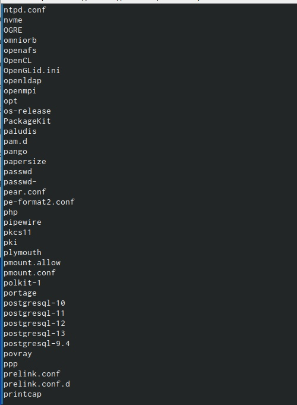
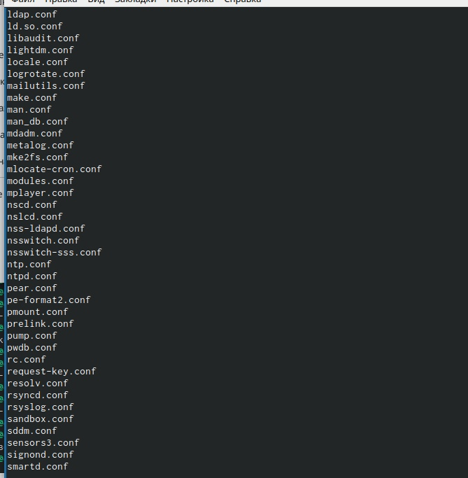
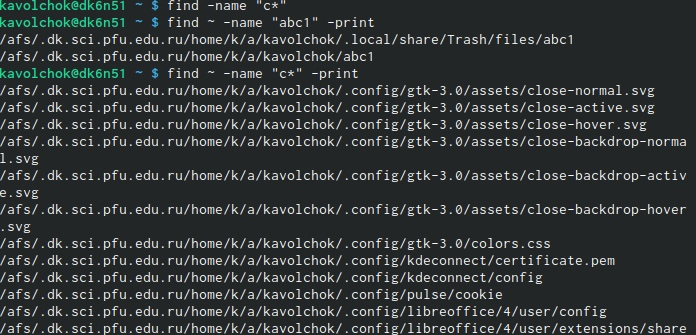
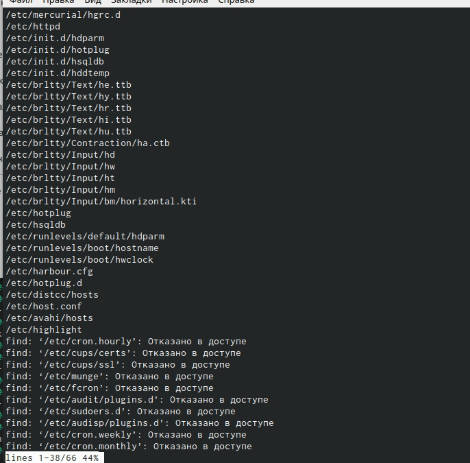
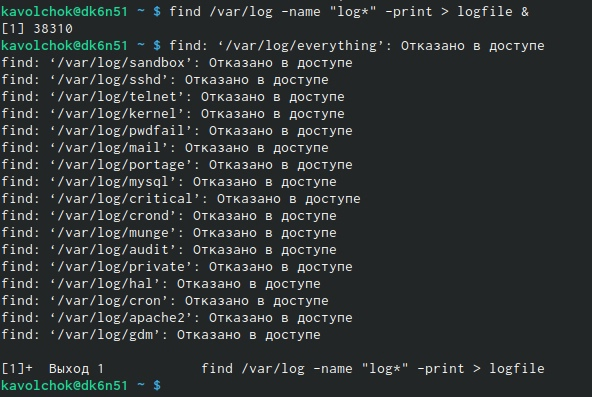
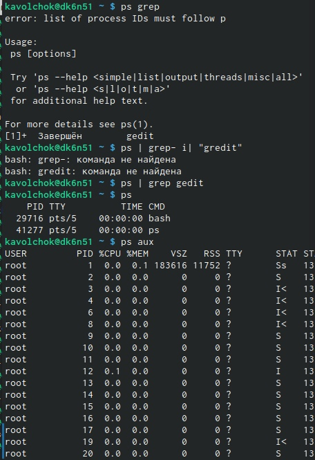
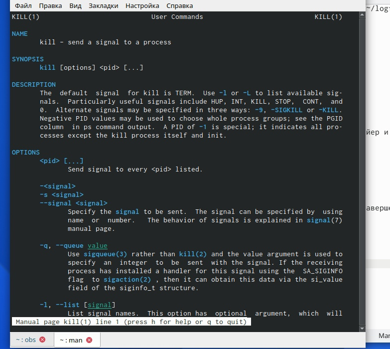
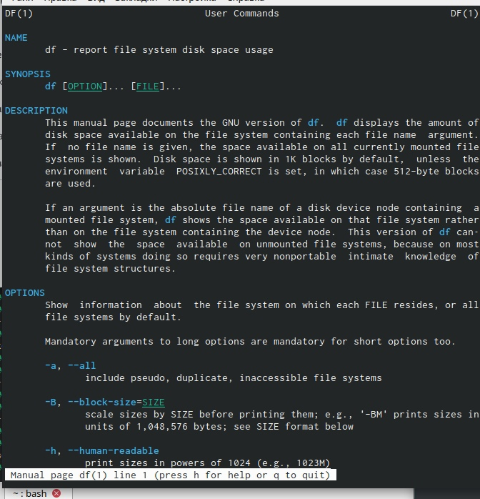
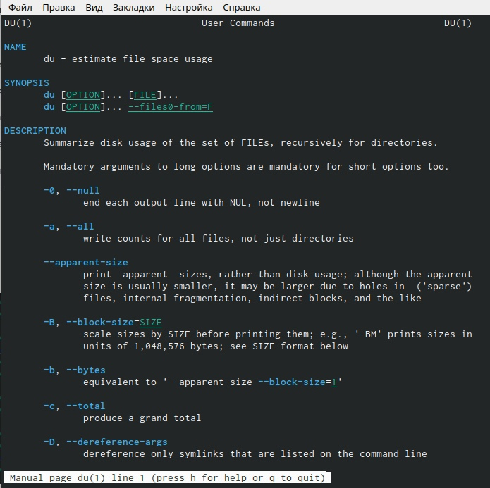

---
## Front matter
title: "Отчёт по лабораторной работе 6"
subtitle: "Дисциплина: Операционные системы"
author: "Волчок Кристина Александровна"

## Generic otions
lang: ru-RU
toc-title: "Содержание"

## Bibliography
bibliography: bib/cite.bib
csl: pandoc/csl/gost-r-7-0-5-2008-numeric.csl

## Pdf output format
toc: true # Table of contents
toc-depth: 2
lof: true # List of figures
lot: true # List of tables
fontsize: 12pt
linestretch: 1.5
papersize: a4
documentclass: scrreprt
## I18n polyglossia
polyglossia-lang:
  name: russian
  options:
	- spelling=modern
	- babelshorthands=true
polyglossia-otherlangs:
  name: english
## I18n babel
babel-lang: russian
babel-otherlangs: english
## Fonts
mainfont: PT Serif
romanfont: PT Serif
sansfont: PT Sans
monofont: PT Mono
mainfontoptions: Ligatures=TeX
romanfontoptions: Ligatures=TeX
sansfontoptions: Ligatures=TeX,Scale=MatchLowercase
monofontoptions: Scale=MatchLowercase,Scale=0.9
## Biblatex
biblatex: true
biblio-style: "gost-numeric"
biblatexoptions:
  - parentracker=true
  - backend=biber
  - hyperref=auto
  - language=auto
  - autolang=other*
  - citestyle=gost-numeric
## Pandoc-crossref LaTeX customization
figureTitle: "Рис."
tableTitle: "Таблица"
listingTitle: "Листинг"
lofTitle: "Список иллюстраций"
lotTitle: "Список таблиц"
lolTitle: "Листинги"
## Misc options
indent: true
header-includes:
  - \usepackage{indentfirst}
  - \usepackage{float} # keep figures where there are in the text
  - \floatplacement{figure}{H} # keep figures where there are in the text
---

# Цель работы
В ходе выполнения лабораторной работы я должна ознакомиться с инструментами поиска файлов и фильтрации текстовых данных.
Приобрести практические навыки по управлению процессами (и заданиями), по
проверке использования диска и обслуживанию файловых систем.

# Задание

1. Запишим в файл file.txt названия файлов, содержащихся в каталоге /etc. Допишим в этот же файл названия файлов, содержащихся в  домашнем каталоге.
2. Выведим имена всех файлов из file.txt, имеющих расширение .conf, после чего
запишим их в новый текстовой файл conf.txt.
3. Определим, какие файлы в вашем домашнем каталоге имеют имена, начинавшиеся
с символа c? 
4. Выведем на экран (по странично) имена файлов из каталога /etc, начинающиеся
с символа h.
5. Запустим в фоновом режиме процесс, который будет записывать в файл ~/logfile
файлы, имена которых начинаются с log.
6. Удалим файл ~/logfile.
7. Запустим из консоли в фоновом режиме редактор gedit.
8. Определим идентификатор процесса gedit, используя команду ps, конвейер и фильтр
grep. 
9. Прочтем справку (man) команды kill, после чего используйте её для завершения
процесса gedit.
10. Выполним команды df и du, предварительно получив более подробную информацию
об этих командах, с помощью команды man.
11. Воспользовавшись справкой команды find, выведем имена всех директорий, имеющихся в домашнем каталоге.

# Выполнение лабораторной работы
1. Запишим в файл file.txt названия файлов, содержащихся в каталоге /etc. Допишим в этот же файл названия файлов, содержащихся в  домашнем каталоге.(рис. [-@fig:001]; [-@fig:002])

{ #fig:001 width=70% }

{ #fig:002 width=70% }

2. Выведим имена всех файлов из file.txt, имеющих расширение .conf, после чего
запишим их в новый текстовой файл conf.txt. Рис.[-@fig:003];[-@fig:004]

{ #fig:003 width=70% }

{ #fig:004 width=70% }

3. Определим, какие файлы в вашем домашнем каталоге имеют имена, начинавшиеся
с символа c? Рис.[-@fig:005]

{ #fig:005 width=70% }

4. Выведем на экран (по странично) имена файлов из каталога /etc, начинающиеся
с символа h.Рис.[-@fig:006];[-@fig:007]

{ #fig:006 width=70% }

{ #fig:007 width=70% }

5. Запустим в фоновом режиме процесс, который будет записывать в файл ~/logfile
файлы, имена которых начинаются с log.Рис.[-@fig:008]

{ #fig:008 width=70% }

6. Удалим файл ~/logfile.Рис.[-@fig:009]

{ #fig:009 width=70% }

7. Запустим из консоли в фоновом режиме редактор geditРис.[-@fig:010].

{ #fig:010 width=70% }

8. Определим идентификатор процесса gedit, используя команду ps, конвейер и фильтр.Рис.[-@fig:011];[-@fig:012]
grep.

{ #fig:011 width=70% }

{ #fig:012 width=70% }

9. Прочтем справку (man) команды kill, после чего используйте её для завершения
процесса gedit. Рис.[-@fig:013];[-@fig:014]

{ #fig:013 width=70% }

{ #fig:014 width=70% }

10. Выполним команды df и du, предварительно получив более подробную информацию
об этих командах, с помощью команды man.Рис.[-@fig:015];[-@fig:016];[-@fig:017]

{ #fig:015 width=70% }

{ #fig:016 width=70% }

{ #fig:017 width=70% }

11. Воспользовавшись справкой команды find, выведем имена всех директорий, имеющихся в домашнем каталоге.

{ #fig:018 width=70% }

# Контрольные вопросы
1) В системе по умолчанию открыто три специальных потока:
– stdin − стандартный поток ввода (по умолчанию: клавиатура), файловый
дескриптор 0;
– stdout − стандартный поток вывода (по умолчанию: консоль), файловый
дескриптор 1;
– stderr − стандартный поток вывод сообщений об ошибках (по умолчанию:
консоль), файловый дескриптор 2.
Большинство используемых в консоли команд и программ записывают
результаты своей работы в стандартный поток вывода stdout.
2) > Перенаправление вывода в файл
 >> Перенаправление вывода в файл и открытие файла в режиме
добавления (данные добавляются в конец файла).
3) Конвейер (pipe) служит для объединения простых команд или утилит в
цепочки, в которых результат работы предыдущей команды передаётся
последующей.
Синтаксис следующий:
команда 1 | команда 2 (это означает, что вывод команды 1 передастся на
ввод команде 2)
4) Процесс рассматривается операционной системой как заявка на
потребление всех видов ресурсов, кроме одного − процессорного времени.
Этот последний важнейший ресурс распределяется операционной
системой между другими единицами работы − потоками, которые и
получили свое название благодаря тому, что они представляют собой
последовательности (потоки выполнения) команд.
Процесс − это выполнение программы. Он считается активной сущностью
и реализует действия, указанные в программе.
Программа представляет собой статический набор команд, а процесс это
набор ресурсов и данных, использующихся при выполнении программы.
5) pid: идентификатор процесса (PID) процесса (process ID), к которому
вызывают метод
gid: идентификатор группы UNIX, в котором работает программа.
6) Любую выполняющуюся в консоли команду или внешнюю программу
можно запустить в фоновом режиме. Для этого следует в конце имени
команды указать знак амперсанда &.
Запущенные фоном программы называются задачами (jobs). Ими можно
управлять с помощью команды jobs, которая выводит список запущенных
в данный момент задач.
7) top − это консольная программа, которая показывает список
работающих процессов в системе. Программа в реальном времени
отсортирует запущенные процессы по их нагрузке на процессор.
htop − это продвинутый консольный мониторинг процессов. Утилита
выводит постоянно меняющийся список системных процессов, который
сортируется в зависимости от нагрузки на ЦПУ. Если делать сравнение с
top, то htop показывает абсолютно все процессы в системе, время их
непрерывного использования, загрузку процессоров и расход оперативной
памяти.
8) find − это команда для поиска файлов и каталогов на основе специальных
условий. Ее можно использовать в различных обстоятельствах, например,
для поиска файлов по разрешениям, владельцам, группам, типу, размеру и
другим подобным критериям.
Команда find имеет такой синтаксис:
find [папка] [параметры] критерий шаблон [действие]
Папка − каталог в котором будем искать
Параметры − дополнительные параметры, например, глубина поиска, и т д
Критерий − по какому критерию будем искать: имя, дата создания, права,
владелец и т д.
Шаблон – непосредственно значение по которому будем отбирать файлы.
Основные параметры:
- -P никогда не открывать символические ссылки
- -L - получает информацию о файлах по символическим ссылкам. Важно
для дальнейшей обработки, чтобы обрабатывалась не ссылка, а сам файл.
- -maxdepth - максимальная глубина поиска по подкаталогам, для поиска
только в текущем каталоге установите 1.
- -depth - искать сначала в текущем каталоге, а потом в подкаталогах
- -mount искать файлы только в этой файловой системе.
- -version - показать версию утилиты find
- -print - выводить полные имена файлов
- -type f - искать только файлы
- -type d - поиск папки в Linux
Основные критерии:
- -name - поиск файлов по имени
- -perm - поиск файлов в Linux по режиму доступа
- -user - поиск файлов по владельцу
- -group - поиск по группе
- -mtime - поиск по времени модификации файла
- -atime - поиск файлов по дате последнего чтения
- -nogroup - поиск файлов, не принадлежащих ни одной группе
- -nouser - поиск файлов без владельцев
- -newer - найти файлы новее чем указанный
- -size - поиск файлов в Linux по их размеру
Примеры:
find ~ -type d поиск директорий в домашнем каталоге
find ~ -type f -name ".*" поиск скрытых файлов в домашнем каталоге
9) Файл по его содержимому можно найти с помощью команды grep: «grep
-r "слово/выражение, которое нужно найти"».
10) Утилита df, позволяет проанализировать свободное пространство на
всех подключенных к системе разделах.
11) При выполнении команды du (без указания папки и опции) можно
получить все файлы и папки текущей директории с их размерами. Для
домашнего каталога: du ~/
12) Основные сигналы (каждый сигнал имеет свой номер), которые
используются для завершения процесса:
- SIGINT – самый безобидный сигнал завершения, означает Interrupt.
Он отправляется процессу, запущенному из терминала с помощью
сочетания клавиш Ctrl+C. Процесс правильно завершает все свои действия
и возвращает управление;
- SIGQUIT – это еще один сигнал, который отправляется с помощью
сочетания клавиш, программе, запущенной в терминале. Он сообщает ей
что нужно завершиться и программа может выполнить корректное
завершение или проигнорировать сигнал. В отличие от предыдущего, она
генерирует дамп памяти. Сочетание клавиш Ctrl+/;
- SIGHUP – сообщает процессу, что соединение с управляющим
терминалом разорвано, отправляется, в основном, системой при разрыве
соединения с интернетом;
- SIGTERM – немедленно завершает процесс, но обрабатывается
программой, поэтому позволяет ей завершить дочерние процессы и
освободить все ресурсы;
- SIGKILL – тоже немедленно завершает процесс, но, в отличие от
предыдущего варианта, он не передается самому процессу, а
обрабатывается ядром. Поэтому ресурсы и дочерние процессы остаются
запущенными.
Также для передачи сигналов процессам в Linux используется утилита kill,
её синтаксис: kill [-сигнал] [pid_процесса] (PID – уникальный
идентификатор процесса). Сигнал представляет собой один из выше
перечисленных сигналов для завершения процесса.[-@fig:014]
Перед тем, как выполнить остановку процесса, нужно определить его PID.
Для этого используют команды ps и grep. Команда ps предназначена для
вывода списка активных процессов в системе и информации
о них. Команда grep запускается одновременно с ps (в канале) и будет
выполнять поиск по результатам команды ps.
Утилита pkill – это оболочка для kill, она ведет себя точно так же, и имеет
тот же синтаксис, только в качестве идентификатора процесса ей нужно
передать его имя.
killall работает аналогично двум предыдущим утилитам. Она тоже
принимает имя процесса в качестве параметра и ищет его PID в директории
/proc. Но эта утилита обнаружит все процессы с таким именем и завершит
их.

# Выводы

В ходе выполнения лабораторной работы я ознакомилась с инструментами поиска файлов и фильтрации текстовых данных.
Приобрела практические навыки по управлению процессами (и заданиями), по
проверке использования диска и обслуживанию файловых систем.

# Список литературы{.unnumbered}

::: {#refs}
:::
