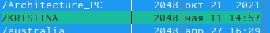

---
## Front matter
title: "Отчёт по лабораторной работе 7"
subtitle: "Дисциплина: Операционные системы"
author: "Волчок Кристина Александровна"

## Generic otions
lang: ru-RU
toc-title: "Содержание"

## Bibliography
bibliography: bib/cite.bib
csl: pandoc/csl/gost-r-7-0-5-2008-numeric.csl

## Pdf output format
toc: true # Table of contents
toc-depth: 2
lof: true # List of figures
fontsize: 12pt
linestretch: 1.5
papersize: a4
documentclass: scrreprt
## I18n polyglossia
polyglossia-lang:
  name: russian
  options:
	- spelling=modern
	- babelshorthands=true
polyglossia-otherlangs:
  name: english
## I18n babel
babel-lang: russian
babel-otherlangs: english
## Fonts
mainfont: PT Serif
romanfont: PT Serif
sansfont: PT Sans
monofont: PT Mono
mainfontoptions: Ligatures=TeX
romanfontoptions: Ligatures=TeX
sansfontoptions: Ligatures=TeX,Scale=MatchLowercase
monofontoptions: Scale=MatchLowercase,Scale=0.9
## Biblatex
biblatex: true
biblio-style: "gost-numeric"
biblatexoptions:
  - parentracker=true
  - backend=biber
  - hyperref=auto
  - language=auto
  - autolang=other*
  - citestyle=gost-numeric
## Pandoc-crossref LaTeX customization
figureTitle: "Рис."
tableTitle: "Таблица"
listingTitle: "Листинг"
lofTitle: "Список иллюстраций"
lotTitle: "Список таблиц"
lolTitle: "Листинги"
## Misc options
indent: true
header-includes:
  - \usepackage{indentfirst}
  - \usepackage{float} # keep figures where there are in the text
  - \floatplacement{figure}{H} # keep figures where there are in the text
---

# Цель работы
В ходе лабораторной работы мы должны освоить основных возможностей командной оболочки Midnight Commander.А также приобрести навыки практической работы по просмотру каталогов и файлов; манипуляций

# Задание

1. Изучите информацию о mc,вызвав в командной строке man mc.

2. Запустите из командной строки mc,изучите его структуру и меню.

3. Выполните несколько операций в mc,используя управляющие клавиши (операции с панелями; выделение/отмена выделения файлов,копирование/перемещение фай- лов, получение информации о размере и правах доступа на файлы и/или каталоги ит.п.)

4. Выполните основные команды меню левой (или правой) панели.Оцените степень подробности вывода информации о файлах.

5. Используя возможности подменю Файл ,выполните: – просмотр содержимоготекстового файла; – редактирование содержимого текстового файла (без сохранения результатов редактирования); – создание каталога; – копирование в файлов в созданный каталог.

6. С помощью соответствующих средств подменю Команда осуществите: – поиск в файловой системе файла с заданными условиями (например, файла с расширением .c или .cpp,содержащего строку main); – выбор и повторение одной из предыдущих команд; – переход в домашний каталог; – анализ файла меню и файла расширений.

7. Вызовите подменю Настройки .Освойте операции,определяющие структуру экрана mc (Full screen,Double Width,Show Hidden Files ит.д.) Задание по встроенному редактору mc

8. Создайте текстовой файл text.txt.

9. Откройте этот файл с помощью встроенного в mc редактора.

10. Вставьте в открытый файл небольшой фрагменттекста,скопированный из любого другого файла или Интернета.

11. Проделайте стекстом следующие манипуляции,используя горячие клавиши: 11.1 Удалите строкутекста.11.2 Выделите фрагменттекста и скопируйте его на новую строку.11.3 Выделите фрагменттекста и перенесите его на новую строку. 11.4. Сохраните файл. 11.5. Отмените последнее действие. 11.6. Перейдите в конец файла (нажав комбинацию клавиш) и напишите некоторый текст. 11.7. Перейдите в начало файла (нажав комбинацию клавиш) и напишите некоторый текст. 11.8. Сохраните и закройте файл.

12. Откройте файл с исходным текстом на некотором языке программирования (напри- мер C или Java)

13. Используя меню редактора,включите подсветку синтаксиса,если она не включена, или выключите,если она включена.

# Выполнение лабораторной работы

1. Изучаем информацию о mc,вызвав в командной строке man mc. (рис. [-@fig:001])

{ #fig:001 width=70% }

2. Запускаем  из командной строки mc,изучите его структуру и меню.(рис. [-@fig:002])

{ #fig:002 width=70% }

3. Выполняем несколько операций в mc,используя управляющие клавиши (операции с панелями; выделение/отмена выделения файлов,копирование/перемещение фай- лов, получение информации о размере и правах доступа на файлы и/или каталоги и т.п.) (рис. [-@fig:003;-@fig:004;-@fig:005;-@fig:006] )

{ #fig:003 width=70% }

{ #fig:004 width=70% }

{ #fig:005 width=70% }

{ #fig:006 width=70% }

4. Выполнила основные команды меню левой (или правой) панели. Оцениваем степень подробности вывода информации о файлах.(рис. [-@fig:007])

{ #fig:007 width=70% }

5. Используя возможности подменю Файл ,выполняем: – просмотр содержимоготекстового файла; – редактирование содержимого текстового файла (без сохранения результатов редактирования); – создание каталога; – копирование в файлов в созданный каталог.(рис. [-@fig:008;-@fig:009;-@fig:010;-@fig:011] )

{ #fig:008 width=70% }

{ #fig:009 width=70% }

{ #fig:010 width=70% }

{ #fig:011 width=70% }

6. С помощью соответствующих средств подменю осуществляем: – поиск в файловой системе файла с заданными условиями (например, файла с расширением .c или .cpp,содержащего строку main); – выбор и повторение одной из предыдущих команд; – переход в домашний каталог; – анализ файла меню и файла расширений.(рис. [-@fig:012;-@fig:013;-@fig:014;-@fig:015;-@fig:016] )

{ #fig:012 width=70% }

{ #fig:013 width=70% }

{ #fig:014 width=70% }

{ #fig:015 width=70% }

{ #fig:016 width=70% }

7. Вызываем подменю Настройки .Осваиваем операции,определяющие структуру экрана mc (Full screen,Double Width,Show Hidden Files ит.д.) Задание по встроенному редактору mc(рис. [-@fig:017])

{ #fig:017 width=70% }

8. Создаем текстовой файл text.txt и открываем этот файл с помощью встроенного в mc редактора.(рис. [-@fig:018])

{ #fig:018 width=70% }

10. Вставляем в открытый файл небольшой фрагмент текста,скопированный из любого другого файла или Интернета.(рис. [-@fig:019])

{ #fig:019 width=70% }

11. Проделываем с текстом следующие манипуляции,используя горячие клавиши: 11.1 Удалите строку текста.11.2 Выделите фрагмент текста и скопируйте его на новую строку.11.3 Выделите фрагмент текста и перенесите его на новую строку. 11.4. Сохраните файл. 11.5. Отмените последнее действие. 11.6. Перейдите в конец файла (нажав комбинацию клавиш) и напишите некоторый текст. 11.7. Перейдите в начало файла (нажав комбинацию клавиш) и напишите некоторый текст. 11.8. Сохраните и закройте файл.(рис. [-@fig:020;-@fig:021;-@fig:022;-@fig:023] )

{ #fig:020 width=70% }

{ #fig:021 width=70% }

{ #fig:022 width=70% }

{ #fig:023 width=70% }

12. Открывем файл с исходным текстом на некотором языке программирования. Используя меню редактора,включаем подсветку синтаксиса.(рис. [-@fig:024])

{ #fig:024 width=70% }

#  Контрольные вопросы

1. Панели могут дополнительно быть переведены в один из двух
режимов: «Информация» или «Дерево». В режиме «Информация» на
панель выводятся сведения о файле и текущей файловой системе,
расположенных на активной панели. В режиме «Дерево» на одной из
панелей выводится структура дерева каталогов.
2. Как с помощью команд shell, так и с помощью меню (комбинаций
клавиш) mc можно выполнить следующие операции с файлами:
- копирование «F5» («cp имя_файла имя_каталога(в который
копируем)») (рис. [-@fig:003])
- перемещение/переименование «F6» («mv имя_файла
имя_каталога(в который перемещаем)») (рис. [-@fig:004])
- создание каталога «F7» («mkdir имя_каталога») 
- удаление «F8» («rm имя_файла»)

3. Перейти в строку меню панелей mc можно с помощью
функциональной клавиши «F9». В строке меню имеются пять меню:
«Левая панель», «Файл», «Команда», «Настройки» и «Правая
панель».
Подпункт меню «Быстрый просмотр» позволяет выполнить быстрый
просмотр содержимого панели.
Подпункт меню «Информация» позволяет посмотреть информацию о
файле или каталоге.
В меню каждой (левой или правой) панели можно выбрать «Формат
списка»:
- стандартный − выводит список файлов и каталогов с указанием
размера и времени правки;
- ускоренный − позволяет задать число столбцов, на которые
разбивается панель при выводе списка имён файлов или
каталогов без дополнительной информации;
- расширенный − помимо названия файла или каталога выводит
сведения о правах доступа, владельце, группе, размере,
времени правки;
- определённый пользователем − позволяет вывести те сведения
о файле или каталоге, которые задаст сам пользователь.
Подпункт меню «Порядок сортировки» позволяет задать критерии
сортировки при выводе списка файлов и каталогов: без сортировки,
по имени, расширенный, время правки, время доступа, время
изменения атрибута, размер, узел.
4. Команды меню «Файл»:
- Просмотр («F3») − позволяет посмотреть содержимое текущего
(или выделенного) файла без возможности редактирования.
- Просмотр вывода команды («М» + «!») − функция запроса
команды с параметрами (аргумент к текущему выбранному
файлу).
- Правка («F4») − открывает текущий (или выделенный) файл
для его редактирования.
- Копирование («F5») − осуществляет копирование одного или
нескольких файлов или каталогов в указанное пользователем во
всплывающем окне место.
- Права доступа («Ctrl-x» «c») − позволяет указать (изменить)
права доступа к одному или нескольким файлам или каталогам.
- Жёсткая ссылка («Ctrl-x» «l») − позволяет создать жёсткую
ссылку к текущему (или выделенному) файлу.
- Символическая ссылка («Ctrl-x» «s») − позволяет создать
символическую ссылку к текущему (или выделенному) файлу.
- Владелец/группа («Ctrl-x» «o») − позволяет задать (изменить)
владельца и имя группы для одного или нескольких файлов или
каталогов.
- Права (расширенные) − позволяет изменить права доступа и
владения для одного или нескольких файлов или каталогов.
- Переименование («F6») − позволяет переименовать (или
переместить) один или несколько файлов или каталогов.
- Создание каталога («F7») − позволяет создать каталог.
- Удалить («F8») − позволяет удалить один или несколько файлов
или каталогов.
- Выход («F10») − завершает работу mc.
5. Меню Команда
В меню Команда содержатся более общие команды для работы с mc.
Команды меню Команда:
- Дерево каталогов − отображает структуру каталогов системы.
- Поиск файла − выполняет поиск файлов по заданным
параметрам.
- Переставить панели − меняет местами левую и правую панели.
- Сравнить каталоги («Ctrl-x» «d») − сравнивает содержимое
двух каталогов.
- Размеры каталогов − отображает размер и время изменения
каталога (по умолчанию в mc размер каталога корректно не
отображается).
- История командной строки − выводит на экран список ранее
выполненных в оболочке команд.
- Каталоги быстрого доступа ( Ctrl-\») − при вызове выполняется
быстрая смена текущего каталога на один из заданного списка.
- Восстановление файлов − позволяет восстановить файлы на
файловых системах ext2 и ext3.
- Редактировать файл расширений − позволяет задать с помощью
определённого синтаксиса действия при запуске файлов с
определённым расширением (например, какое программного
обеспечение запускать для открытия или редактирования
файлов с расширением doc или docx).
- Редактировать файл меню − позволяет отредактировать
контекстное меню пользователя, вызываемое по клавише «F2».
- Редактировать файл расцветки имён − позволяет подобрать
оптимальную для пользователя расцветку имён файлов в
зависимости от их типа.
6. Меню Настройки содержит ряд дополнительных опций по внешнему
виду и функциональности mc.
Меню Настройки содержит:
- Конфигурация − позволяет скорректировать настройки работы
с панелями.
- Внешний вид и Настройки панелей − определяет элементы
(строка меню, командная строка, подсказки и прочее),
отображаемые при вызове mc, а также геометрию
расположения панелей и цветовыделение.
- Биты символов − задаёт формат обработки информации
локальным терминалом.
- Подтверждение − позволяет установить или убрать вывод окна
с запросом подтверждения действий при операциях удаления и
перезаписи файлов, а также при выходе из программы.
- Распознание клавиш − диалоговое окно используется для
тестирования функциональных клавиш, клавиш управления
курсором и прочее.
- Виртуальные ФС − настройки виртуальной файловой системы:
тайм-аут, пароль и прочее.
7. Функциональные клавиши mc:
- F1 – вызов контекстно-зависимой подсказки
- F2 – вКак с помощью команд shell, так и с помощью меню (комбинаций
клавиш) mc можно выполнить следующие операции с файлами:
- F3 – просмотр содержимого файла, на который указывает
подсветка в активной панели (без возможности
редактирования)
- F4 – вызов встроенного в mc редактора для изменения
содержания файла, на который указывает подсветка в активной
панели
- F5 – копирование одного или нескольких файлов, отмеченных
в первой (активной) панели, в каталог, отображаемый на второй
панели
- F6 – перенос одного или нескольких файлов, отмеченных в
первой (активной) панели, в каталог, отображаемый на второй
панели
- F7 – создание подкаталога в каталоге, отображаемом в активной
панели
- F8 – удаление одного или нескольких файлов (каталогов),
отмеченных в первой (активной) панели файлов
- F9 – вызов меню mc
- F10 – выход из mc
8. Встроенный в mc редактор вызывается с помощью функциональной
клавиши «F4». В нём удобно использовать различные комбинации
клавиш при редактировании содержимого (как правило текстового)
файла.
Клавиши для редактирования файла:
- «Ctrl-y» − удалить строку
- «Ctrl-u» − отмена последней операции
- «ins» вставка/замена
- «F7» − поиск (можно использовать регулярные выражения)
- «↑-F7» − повтор последней операции поиска
- «F4» − замена
- «F3» − первое нажатие − начало выделения, второе − окончание
выделения
- «F5» − копировать выделенный фрагмент
- «F6» − переместить выделенный фрагмент
- «F8» − удалить выделенный фрагмент
- «F2» − записать изменения в файл
- «F10» − выйти из редактор
9. Для редактирования меню пользователя, которое вызывается
клавишей «F2», необходимо перейти в пункт «Редактировать файл
меню» → «Команда» и изменить настройки файла.
10.  Часть команд «Меню пользователя», а также меню «Файл»
позволяют выполнять действия, определяемые пользователем, над
текущим файлом. Например, копирование каталога или файла,
переименование, перемещение, архивирование

# Выводы

В ходе  проделанной лабораторной работы мы освоили основные возможности командной оболочки Midnight Commander.А также приобрели навыки практической работы по просмотру каталогов и файлов; манипуляций

