---
## Front matter
title: "Отчёт по лабораторной работе 8"
subtitle: "Дисциплина: Операционные системы"
author: "Волчок Кристина Александровна"

## Generic otions
lang: ru-RU
toc-title: "Содержание"

## Bibliography
bibliography: bib/cite.bib
csl: pandoc/csl/gost-r-7-0-5-2008-numeric.csl

## Pdf output format
toc: true # Table of contents
toc-depth: 2
lof: true # List of figures
fontsize: 12pt
linestretch: 1.5
papersize: a4
documentclass: scrreprt
## I18n polyglossia
polyglossia-lang:
  name: russian
  options:
	- spelling=modern
	- babelshorthands=true
polyglossia-otherlangs:
  name: english
## I18n babel
babel-lang: russian
babel-otherlangs: english
## Fonts
mainfont: PT Serif
romanfont: PT Serif
sansfont: PT Sans
monofont: PT Mono
mainfontoptions: Ligatures=TeX
romanfontoptions: Ligatures=TeX
sansfontoptions: Ligatures=TeX,Scale=MatchLowercase
monofontoptions: Scale=MatchLowercase,Scale=0.9
## Biblatex
biblatex: true
biblio-style: "gost-numeric"
biblatexoptions:
  - parentracker=true
  - backend=biber
  - hyperref=auto
  - language=auto
  - autolang=other*
  - citestyle=gost-numeric
## Pandoc-crossref LaTeX customization
figureTitle: "Рис."
tableTitle: "Таблица"
listingTitle: "Листинг"
lofTitle: "Список иллюстраций"
lotTitle: "Список таблиц"
lolTitle: "Листинги"
## Misc options
indent: true
header-includes:
  - \usepackage{indentfirst}
  - \usepackage{float} # keep figures where there are in the text
  - \floatplacement{figure}{H} # keep figures where there are in the text
---

# Цель работы

В ходе лабораторной работы мы должны познакомиться с операционной системой Linux. А также получить практические навыки работы с редактором vi, установленным по умолчанию практически во всех дистрибутивах

# Задание
1. Создать каталог с именем ~/work/os/lab06.
2. Перейти во вновь созданный каталог.
3. Вызвать vi и создать файл hello.sh
4. Нажать клавишу i и ввести текст.
5. Нажать клавишу Esc для перехода в командный режим после завершения ввода
текста.
6. Нажать : для перехода в режим последней строки и внизу вашего экрана появится
приглашение в виде двоеточия.
7. Нажать w (записать) и q (выйти), а затем нажать клавишу Enter для сохранения
текста и завершения работы.
8. Сделать файл исполняемым

9. Вызвать vi на редактирование файла
10. Установить курсор в конец слова HELL второй строки.
11. Перейти в режим вставки и замените на HELLO. Нажать Esc для возврата в командный режим.
12. Установить курсор на четвертую строку и стереть слово LOCAL.
13. Перейти в режим вставки и наберите следующий текст: local, нажмите Esc для
возврата в командный режим.
14. Установить курсор на последней строке файла. Вставить после неё строку, содержащую
следующий текст: echo $HELLO.
15. Нажать Esc для перехода в командный режим.
16. Удалить последнюю строку.
17. Ввести команду отмены изменений u для отмены последней команды.
18. Ввести символ : для перехода в режим последней строки. Записать произведённые
изменения и выйдите из vi.

# Выполнение лабораторной работы
 
 Создание нового файла с использованием vi 
1. Создаем каталог с именем ~/work/os/lab06. Рис.[-@fig:001]

{ #fig:001 width=70% }

2. Переходим во вновь созданный каталог. Рис.[-@fig:002]

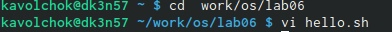{ #fig:002 width=70% }

3. Вызываем vi и создаем файл hello.sh. Рис.[-@fig:003]

{ #fig:003 width=70% }

4. Нажимаем клавишу i и ввести текст. Рис.[-@fig:004]

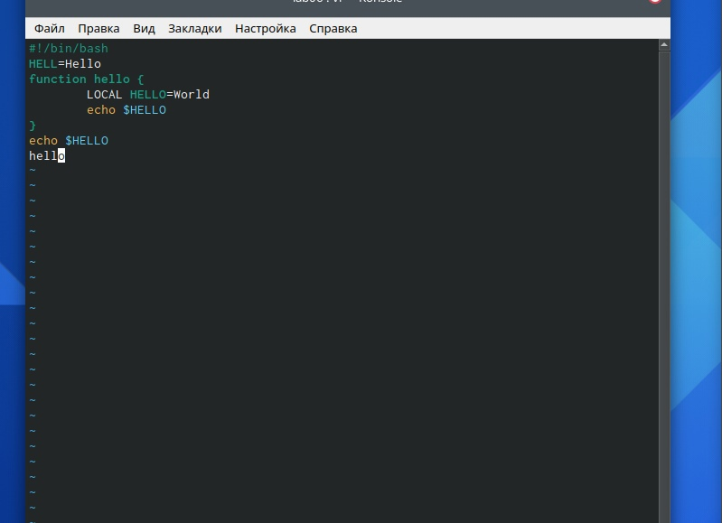{ #fig:004 width=70% }

5. Нажимаем : для перехода в режим последней строки и внизу вашего экрана появится
приглашение в виде двоеточия. Рис.[-@fig:005]

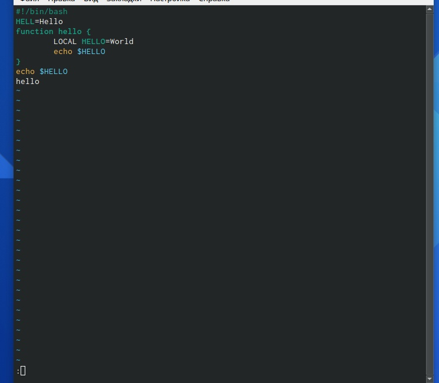{ #fig:005 width=70% }

6. Нажимаем w (записать) и q (выйти), а затем нажать клавишу Enter для сохранения
текста и завершения работы. Рис.[-@fig:006]

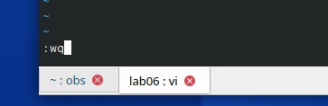{ #fig:006 width=70% }

7. Сделаем файл исполняемым. Рис.[-@fig:007]

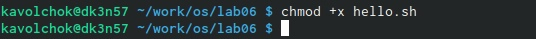{ #fig:007 width=70% }

Редактирование существующего файла

1. Вызываем vi на редактирование файла. Рис.[-@fig:008]

{ #fig:008 width=70% }

2. Устанавливаем курсор в конец слова HELL второй строки.Рис.[-@fig:009]

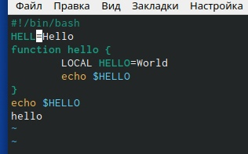{ #fig:009 width=70% }

3. Переходим в режим вставки и заменяем на HELLO. Нажимаем Esc для возврата в командный режим.Рис.[-@fig:010]

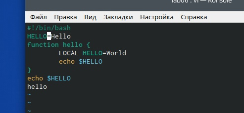{ #fig:010 width=70% }

4. Установливаем курсор на четвертую строку и стираем слово LOCAL. Рис.[-@fig:011]

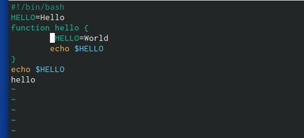{ #fig:011 width=70% }

5. Переходим в режим вставки и набираем следующий текст: local, нажимаем Esc для
возврата в командный режим. Рис.[-@fig:012]

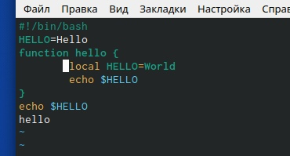{ #fig:012 width=70% }

6. Устанавливаем курсор на последней строке файла. Вставим после неё строку, содержащую
следующий текст: echo $HELLO. Рис.[-@fig:013]

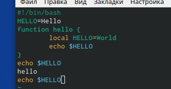{ #fig:013 width=70% }

7. Удаляем последнюю строку.Рис.[-@fig:014]

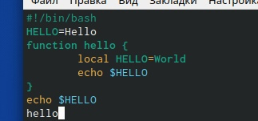{ #fig:014 width=70% }

8. Вводим команду отмены изменений u для отмены последней команды.Рис.[-@fig:015]

{ #fig:015 width=70% }

9. Вводим символ : для перехода в режим последней строки. Записываем произведённые
изменения и выходим из vi. Рис.[-@fig:016]

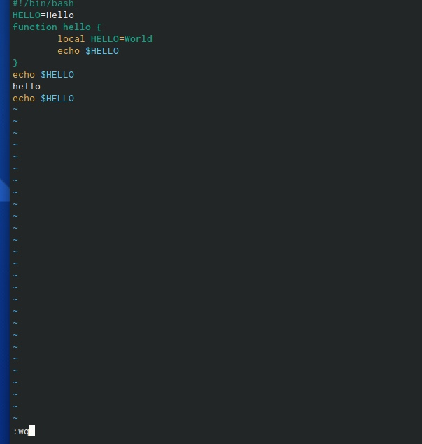{ #fig:016 width=70% }

# Контрольные вопросы
1. Редактор vi имеет три режима работы:
- командный режим − предназначен для ввода команд редактирования
и навигации по редактируемому файлу;
- режим вставки − предназначен для ввода содержания
редактируемого файла;
- режим последней (или командной) строки − используется для записи
изменений в файл и выхода из редактора.
2. Чтобы выйти из редактора, не сохраняя произведённые изменения,
нужно в режиме командной строки нажать клавиши «:» «q» «!»
3. Команды позиционирования:
- «0» (ноль) − переход в начало строки;
- «$» − переход в конец строки;
- «G» − переход в конец файла; 
- n«G» − переход на строку с номером n.
4. При использовании прописных W и B под разделителями понимаются
только пробел, табуляция и возврат каретки. При использовании
строчных w и b под разделителями понимаются также любые знаки
пунктуации.
5. Чтобы из любого места редактируемого файла перейти в начало (конец)
файла, нужно в режиме командной строки нажать клавиши «1» «G»
(«G»).
6. Команды редактирования:
Вставка текста
- «а» − вставить текст после курсора;
- «А» − вставить текст в конец строки;
- «i» − вставить текст перед курсором;
- n «i» − вставить текст n раз;
- «I» − вставить текст в начало строки.
Вставка строки
- «о» − вставить строку под курсором;
- «О» − вставить строку над курсором.
Удаление текста
- «x» − удалить один символ в буфер;
- «d» «w» − удалить одно слово в буфер;
- «d» «$» − удалить в буфер текст от курсора до конца строки;
- «d» «0» − удалить в буфер текст от начала строки до позиции
курсора;
- «d» «d» − удалить в буфер одну строку;
- n «d» «d» − удалить в буфер n строк.
Отмена и повтор произведённых изменений
- «u» − отменить последнее изменение;
- «.» − повторить последнее изменение. 
Копирование текста в буфер
- «Y» − скопировать строку в буфер;
- n «Y» − скопировать n строк в буфер;
- «y» «w» − скопировать слово в буфер.
Вставка текста из буфера
- «p» − вставить текст из буфера после курсора;
- «P» − вставить текст из буфера перед курсором.
Замена текста
- «c» «w» − заменить слово;
- n «c» «w» − заменить n слов;
- «c» «$» − заменить текст от курсора до конца строки;
- «r» − заменить слово;
- «R» − заменить текст.
Поиск текста
- «/» текст − произвести поиск вперёд по тексту указанной строки
символов текст;
- «?» текст − произвести поиск назад по тексту указанной строки
символов текст.
Копирование и перемещение текста
- «:» n,m «d» – удалить строки с n по m;
- «:» i,j «m» k – переместить строки с i по j, начиная со строки k;
- «:» i,j «t» k – копировать строки с i по j в строку k;
- «:» i,j «w» имя-файла – записать строки с i по j в файл с именем
имя-файла
7. Чтобы заполнить строку символами $, необходимо для начала перейти
на эту строку, нажав клавиши n «G», где n – номер строки, далее нажать
«0» для перехода в начало строки. Теперь необходимо нажать «c» «$»,
чтобы заменить текст от курсора до конца строки, и ввести символы $.
8. Чтобы отменить по одному предыдущему действию последовательно, 
необходимо нажать «u». Чтобы отменить все изменения, произведённые
со времени последней записи, нужно нажать «:» «e» «!».
9. Команды редактирования в режиме командной строки
Копирование и перемещение текста
- «:» n,m «d» − удалить строки с n по m;
- «:» i,j «m» k − переместить строки с i по j, начиная со строки k;
- «:» i,j «t» k − копировать строки с i по j в строку k;
- «:» i,j «w» имя-файла − записать строки с i по j в файл с именем
имя-файла.
Запись в файл и выход из редактора
- «:» «w» − записать изменённый текст в файл, не выходя из vi;
- «:» «w» имя-файла − записать изменённый текст в новый файл с
именем имя-файла;
- «:» «w» «!» имя-файла − записать изменённый текст в файл с
именем имя-файла;
- «:» «w» «q» − записать изменения в файл и выйти из vi;
- «:» «q» − выйти из редактора vi;
- «:» «q» «!» − выйти из редактора без записи;
- «:» «e» «!» − вернуться в командный режим, отменив все
изменения, произведённые со времени последней записи.
Опции
Опции редактора vi позволяют настроить рабочую среду. Для задания
опций используется команда set (в режиме последней строки):
- «:» set all − вывести полный список опций;
- «:» set nu − вывести номера строк;
- «:» set list − вывести невидимые символы;
- «:» set ic − не учитывать при поиске, является ли символ
прописным или строчным.
Если вы хотите отказаться от использования опции, то в команде set
перед именем опции надо поставить no.
10. Чтобы определить, не перемещая курсора, позицию, в которой
заканчивается строка, нужно в командном режиме находясь на нужной
строке нажать «$» и посмотреть на число после запятой в правом
нижнем углу экрана 
11. Опции редактора vi позволяют настроить рабочую среду. Для
задания опций используется команда set (в режиме командной строки).
Если вы хотите отказаться от использования опции, то в команде set
перед именем опции надо поставить no.
Чтобы просмотреть опции редактора vi, необходимо нажать «:» set all. Нажав «:» help “название_опции”, можно узнать
назначение конкретной опции.
12. В режиме командной строки внизу редактора присутствует «:», в
режиме ввода – «-- ВСТАВКА --», в командном режиме внизу ничего
нет
13. Граф взаимосвязи режимов работы редактора vi.Рис.[-@fig:017]

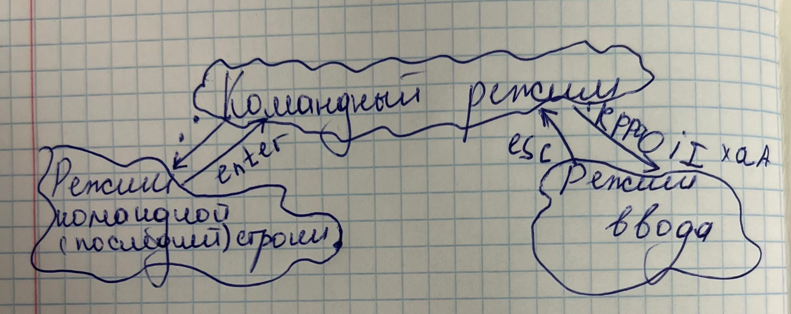{ #fig:017 width=70% }

# Вывод

В ходе проделанной  лабораторной работы я познакомилась с операционной системой Linux. А также получила практические навыки работы с редактором vi, установленным по умолчанию практически во всех дистрибутивах.

