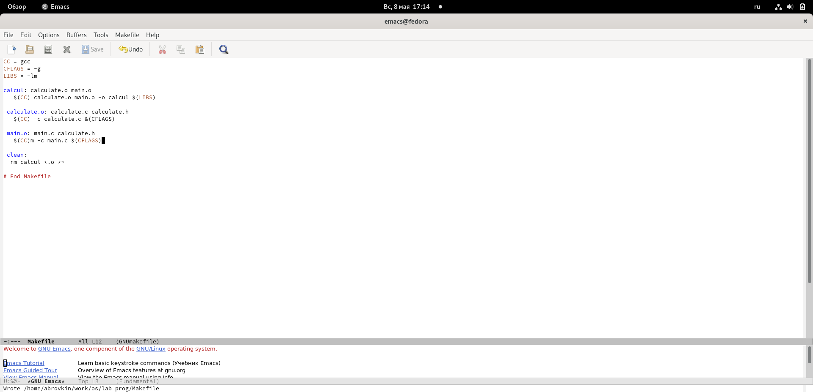

---
## Front matter
title: "Отчёт по лабораторной работе 13"
subtitle: "Дисциплина: Операционные системы"
author: "Волчок Кристина Александровна"
## Generic otions
lang: ru-RU
toc-title: "Содержание"

## Bibliography
bibliography: bib/cite.bib
csl: pandoc/csl/gost-r-7-0-5-2008-numeric.csl

## Pdf output format
toc: true # Table of contents
toc-depth: 2
lof: true # List of figures
fontsize: 12pt
linestretch: 1.5
papersize: a4
documentclass: scrreprt
## I18n polyglossia
polyglossia-lang:
  name: russian
  options:
	- spelling=modern
	- babelshorthands=true
polyglossia-otherlangs:
  name: english
## I18n babel
babel-lang: russian
babel-otherlangs: english
## Fonts
mainfont: PT Serif
romanfont: PT Serif
sansfont: PT Sans
monofont: PT Mono
mainfontoptions: Ligatures=TeX
romanfontoptions: Ligatures=TeX
sansfontoptions: Ligatures=TeX,Scale=MatchLowercase
monofontoptions: Scale=MatchLowercase,Scale=0.9
## Biblatex
biblatex: true
biblio-style: "gost-numeric"
biblatexoptions:
  - parentracker=true
  - backend=biber
  - hyperref=auto
  - language=auto
  - autolang=other*
  - citestyle=gost-numeric
## Pandoc-crossref LaTeX customization
figureTitle: "Рис."
tableTitle: "Таблица"
listingTitle: "Листинг"
lofTitle: "Список иллюстраций"
lolTitle: "Листинги"
## Misc options
indent: true
header-includes:
  - \usepackage{indentfirst}
  - \usepackage{float} # keep figures where there are in the text
  - \floatplacement{figure}{H} # keep figures where there are in the text
---

# Цель работы

В ходе лабораторной работы мы должны приобрести простейшие навыки разработки,анализа,тестирования и отладки приложений в ОС типа UNIX/Linux на примере создания на языке программирования с калькулятора с простейшими функциями.

# Задание

1. В домашнем каталоге создайте подкаталог ~/work/os/lab_prog.

2. Создайте в нём файлы: calculate.h,calculate.c,main.c.
Это будетпримитивнейший калькулятор,способный складывать,вычитать,умножать
и делить,возводить число в степень,брать квадратный корень,вычислять sin,cos,tan.
При запуске он будетзапрашиватьпервое число,операцию,второе число.После этого
программа выведет результати остановится.
Реализация функций калькулятора в файле calculate.h:

Интерфейсный файл calculate.h, описывающий формат вызова функции-
калькулятора:

3. Выполните компиляцию программы посредством gcc:

4. При необходимости исправьте синтаксические ошибки.

5. Создайте Makefile со следующим содержанием:
Поясните в отчёте его содержание.

6. С помощью gdb выполните отладку программы calcul (перед использованием gdb исправьте Makefile):
– Запустите отладчик GDB,загрузив в него программу для отладки: gdb ./calcul
– Для запуска программы внутри отладчика введите команду run:
1 run
– Для постраничного (по 9 строк) просмотра исходного код используйте команду
list:
1 list
– Дляпросмотрастрокс12по15основногофайлаиспользуйтеlist спараметрами:
1 list 12,15
– Для просмотра определённых строк не основного файла используйте list с па-
раметрами:
1 list calculate.c:20,29
– Установитеточку останова в файле calculate.c на строке номер 21:
1 list calculate.c:20,27
2 break 21
– Выведите информацию об имеющихся в проектеточка останова:
1 info breakpoints
– Запустите программу внутри отладчика и убедитесь,что программа остановится
в момент прохожденияточки останова:
run
 5
 -
 backtrace
– Отладчик выдастследующую информацию:
1 #0 Calculate (Numeral=5, Operation=0x7fffffffd280 "-")
2 at calculate.c:21
3 #1 0x0000000000400b2b in main () at main.c:17
акомандаbacktrace покажетвесьстеквызываемыхфункцийотначалапрограм-
мы дотекущего места.
– Посмотрите,чему равно на этом этапе значение переменной Numeral,введя:
110 Лабораторная работа No 13. Средства,применяемые при разработке программного...
1 print Numeral
На экран должно быть выведено число 5.
– Сравните с результатом вывода на экран после использования команды:
1 display Numeral
– Уберитеточки останова:
1 info breakpoints
2 delete 1

7. С помощью утилиты splint попробуйте проанализировать коды файлов calculate.c
и main.c.

# Выполнение лабораторной работы

1. В домашнем каталоге создал подкаталог ~/work/os/lab_prog.(рис. [-@fig:001])

{ #fig:001 width=70% }

2. Создала в нём файлы: calculate.h, calculate.c, main.c. Это примитивнейший калькулятор, способный складывать, вычитать, умножать, делить, возводить число в степень, вычислять квадратный корень, вычислять sin, cos, tan. При запуске он запрашивает первое число, операцию, второе число. После этого программа выводит результат и останавливается.(рис. [-@fig:002])

{ #fig:002 width=70% }

Реализация функций калькулятора в файле calculate.c:(рис. [-@fig:003])(рис. [-@fig:004])

{ #fig:003 width=70% }

{ #fig:004 width=70% }

Интерфейсный файл calculate.h, описывающий формат вызова функции калькулятора:(рис. [-@fig:005])

{ #fig:005 width=70% }

Основной файл main.c, реализующий интерфейс пользователя к калькулятору:(рис. [-@fig:006])

{ #fig:006 width=70% }

3.Выполнила компиляцию программы посредством gcc:(рис. [-@fig:007])(рис. [-@fig:008])

{ #fig:007 width=70% }

{ #fig:008 width=70% }

4. Исправила синтаксические ошибки.

5. Создала Makefile.(рис. [-@fig:009])

{ #fig:009 width=70% }

В содержании файла указаны флаги компиляции, тип компилятора и файлы, которые должен собрать сборщик.

6. С помощью gdb выполнила отладку программы calcul (перед использованием gdb исправил Makefile):
– запустите отладчик GDB, загрузив в него программу для отладки: gdb ./calcul
– для запуска программы внутри отладчика ввела команду run(рис. [-@fig:010])(рис. [-@fig:011])

{ #fig:010 width=70% }

{ #fig:011 width=70% }

– для постраничного (по 9 строк) просмотра исходного код использовал команду list
– для просмотра строк с 12 по 15 основного файла использовал list с параметрами:
list 12,15(рис. [-@fig:012])(рис. [-@fig:013])

{ #fig:012 width=70% }

{ #fig:013 width=70% }

– для просмотра определённых строк не основного файла использовал list с параметрами: list calculate.c:20,29
– установила точку останова в файле calculate.c на строке номер 21: 
list calculate.c:20,27
break 20
– вывела информацию об имеющихся в проекте точка останова: info breakpoints(рис. [-@fig:014])(рис. [-@fig:015])

{ #fig:014 width=70% }

{ #fig:015 width=70% }

– запустила программу внутри отладчика и убедилась, что программа остановится в момент прохождения точки останова
– отладчик выдал следующую информацию, а команда backtrace показала весь стек вызываемых функций от начала программы до текущего места:
– посмотрела, чему равно на этом этапе значение переменной Numeral, введя:
print Numeral
– сравнила с результатом вывода на экран после использования команды:
display Numeral
– убрала точки останова:
info breakpoints
delete 1(рис. [-@fig:016])(рис. [-@fig:017])(рис. [-@fig:018])

{ #fig:016 width=70% }

{ #fig:017 width=70% }

{ #fig:018 width=70% }

7. С помощью утилиты splint анализирую коды файлов
calculate.c и main.c.(рис. [-@fig:019])(рис. [-@fig:020])

{ #fig:019 width=70% }

{ #fig:020 width=70% }

# Контрольные вопросы:

1. Как получить информацию о возможностях программ gcc, make, gdb и др.?
2. Назовите и дайте краткую характеристику основным этапам разработки приложений
в UNIX.
3. Что такое суффикс в контексте языка программирования? Приведите примеры использования.
4. Каково основное назначение компилятора языка С в UNIX?
5. Для чего предназначена утилита make?
6. Приведите пример структуры Makefile. Дайте характеристику основным элементам
этого файла.
7. Назовите основное свойство, присущее всем программам отладки. Что необходимо
сделать, чтобы его можно было использовать?
8. Назовите и дайте основную характеристику основным командам отладчика gdb.
9. Опишите по шагам схему отладки программы, которую Вы использовали при выполнении лабораторной работы.
10. Прокомментируйте реакцию компилятора на синтаксические ошибки в программе
при его первом запуске.
11. Назовите основные средства, повышающие понимание исходного кода программы.
12. Каковы основные задачи, решаемые программой splint?

# Ответы на контрольные вопросы
1) Чтобы получить информацию о возможностях программ gcc, make, gdb
и др. нужно воспользоваться командой man или опцией -help (-h) для
каждой команды.
2) Процесс разработки программного обеспечения обычно разделяется на
следующие этапы:
- планирование, включающее сбор и анализ требований к 
функционалу и другим характеристикам разрабатываемого
приложения;
- проектирование, включающее в себя разработку базовых
алгоритмов и спецификаций, определение языка
программирования;
- непосредственная разработка приложения:
o кодирование − по сути создание исходного текста
программы (возможно в нескольких вариантах); – анализ
разработанного кода;
o сборка, компиляция и разработка исполняемого модуля;
o тестирование и отладка, сохранение произведённых
изменений;
- документирование.
Для создания исходного текста программы разработчик может
воспользоваться любым удобным для него редактором текста: vi, vim,
mceditor, emacs, geany и др.
После завершения написания исходного кода программы (возможно
состоящей из нескольких файлов), необходимо её скомпилировать и
получить исполняемый модуль.
3) Для имени входного файла суффикс определяет какая компиляция
требуется. Суффиксы указывают на тип объекта. Файлы с расширением
(суффиксом) .c воспринимаются gcc как программы на языке С, файлы
с расширением .cc или .C − как файлы на языке C++, а файлы c
расширением .o считаются объектными. Например, в команде «gcc -c
main.c»: gcc по расширению (суффиксу) .c распознает тип файла для
компиляции и формирует объектный модуль − файл с расширением .o.
Если требуется получить исполняемый файл с определённым именем
(например, hello), то требуется воспользоваться опцией -o и в качестве
параметра задать имя создаваемого файла: «gcc -o hello main.c».
4) Основное назначение компилятора языка Си в UNIX заключается в 
компиляции всей программы и получении исполняемого файла/модуля.
5) Для сборки разрабатываемого приложения и собственно компиляции
полезно воспользоваться утилитой make. Она позволяет
автоматизировать процесс преобразования файлов программы из одной
формы в другую, отслеживает взаимосвязи между файлами.
6) Для работы с утилитой make необходимо в корне рабочего каталога с
Вашим проектом создать файл с названием makefile или Makefile, в
котором будут описаны правила обработки файлов Вашего
программного комплекса.
В самом простом случае Makefile имеет следующий синтаксис:
<цель_1> <цель_2> ... : <зависимость_1> <зависимость_2> ...
<команда 1>
...
<команда n>
Сначала задаётся список целей, разделённых пробелами, за которым
идёт двоеточие и список зависимостей. Затем в следующих строках
указываются команды. Строки с командами обязательно должны
начинаться с табуляции.
В качестве цели в Makefile может выступать имя файла или название
какого-то действия. Зависимость задаёт исходные параметры (условия)
для достижения указанной цели. Зависимость также может быть
названием какого-то действия. Команды − собственно действия,
которые необходимо выполнить для достижения цели.
Общий синтаксис Makefile имеет вид:
target1 [target2...]:[:] [dependment1...]
[(tab)commands] [#commentary]
[(tab)commands] [#commentary]
Здесь знак # определяет начало комментария (содержимое от знака # и
до конца строки не будет обрабатываться. Одинарное двоеточие
указывает на то, что последовательность команд должна содержаться в 
одной строке. Для переноса можно в длинной строке команд можно
использовать обратный слэш (\). Двойное двоеточие указывает на то,
что последовательность команд может содержаться в нескольких
последовательных строках.
Пример более сложного синтаксиса Makefile:
#
# Makefile for abcd.c
#
CC = gcc
CFLAGS =
# Compile abcd.c normaly
abcd: abcd.c
$(CC) -o abcd $(CFLAGS) abcd.c
clean:
-rm abcd *.o *~
# End Makefile for abcd.c
В этом примере в начале файла заданы три переменные: CC и CFLAGS.
Затем указаны цели, их зависимости и соответствующие команды. В
командах происходит обращение к значениям переменных. Цель с
именем clean производит очистку каталога от файлов, полученных в
результате компиляции. Для её описания использованы регулярные
выражения.
7) Во время работы над кодом программы программист неизбежно
сталкивается с появлением ошибок в ней. Использование отладчика для
поиска и устранения ошибок в программе существенно облегчает жизнь
программиста. В комплект программ GNU для ОС типа UNIX входит
отладчик GDB (GNU Debugger). 
Для использования GDB необходимо скомпилировать анализируемый
код программы таким образом, чтобы отладочная информация
содержалась в результирующем бинарном файле. Для этого следует
воспользоваться опцией -g компилятора gcc:
gcc -c file.c -g
После этого для начала работы с gdb необходимо в командной строке
ввести одноимённую команду, указав в качестве аргумента
анализируемый бинарный файл:
gdb file.o
8) Основные команды отладчика gdb:
- backtrace − вывод на экран пути к текущей точке останова (по сути
вывод − названий всех функций)
- break − установить точку останова (в качестве параметра может
быть указан номер строки или название функции)
- clear − удалить все точки останова в функции
- continue − продолжить выполнение программы
- delete − удалить точку останова
- display − добавить выражение в список выражений, значения
которых отображаются при достижении точки останова
программы
- finish − выполнить программу до момента выхода из функции
- info breakpoints − вывести на экран список используемых точек
останова
- info watchpoints − вывести на экран список используемых
контрольных выражений1) Чтобы получить информацию о возможностях программ gcc, make, gdb
и др. нужно воспользоваться командой man или опцией -help (-h) для
каждой команды.
2) Процесс разработки программного обеспечения обычно разделяется на
следующие этапы:
- планирование, включающее сбор и анализ требований к 
функционалу и другим характеристикам разрабатываемого
приложения;
- проектирование, включающее в себя разработку базовых
алгоритмов и спецификаций, определение языка
программирования;
- непосредственная разработка приложения:
o кодирование − по сути создание исходного текста
программы (возможно в нескольких вариантах); – анализ
разработанного кода;
o сборка, компиляция и разработка исполняемого модуля;
o тестирование и отладка, сохранение произведённых
изменений;
- документирование.
Для создания исходного текста программы разработчик может
воспользоваться любым удобным для него редактором текста: vi, vim,
mceditor, emacs, geany и др.
После завершения написания исходного кода программы (возможно
состоящей из нескольких файлов), необходимо её скомпилировать и
получить исполняемый модуль.
3) Для имени входного файла суффикс определяет какая компиляция
требуется. Суффиксы указывают на тип объекта. Файлы с расширением
(суффиксом) .c воспринимаются gcc как программы на языке С, файлы
с расширением .cc или .C − как файлы на языке C++, а файлы c
расширением .o считаются объектными. Например, в команде «gcc -c
main.c»: gcc по расширению (суффиксу) .c распознает тип файла для
компиляции и формирует объектный модуль − файл с расширением .o.
Если требуется получить исполняемый файл с определённым именем
(например, hello), то требуется воспользоваться опцией -o и в качестве
параметра задать имя создаваемого файла: «gcc -o hello main.c».
4) Основное назначение компилятора языка Си в UNIX заключается в 
компиляции всей программы и получении исполняемого файла/модуля.
5) Для сборки разрабатываемого приложения и собственно компиляции
полезно воспользоваться утилитой make. Она позволяет
автоматизировать процесс преобразования файлов программы из одной
формы в другую, отслеживает взаимосвязи между файлами.
6) Для работы с утилитой make необходимо в корне рабочего каталога с
Вашим проектом создать файл с названием makefile или Makefile, в
котором будут описаны правила обработки файлов Вашего
программного комплекса.
В самом простом случае Makefile имеет следующий синтаксис:
<цель_1> <цель_2> ... : <зависимость_1> <зависимость_2> ...
<команда 1>
...
<команда n>
Сначала задаётся список целей, разделённых пробелами, за которым
идёт двоеточие и список зависимостей. Затем в следующих строках
указываются команды. Строки с командами обязательно должны
начинаться с табуляции.
В качестве цели в Makefile может выступать имя файла или название
какого-то действия. Зависимость задаёт исходные параметры (условия)
для достижения указанной цели. Зависимость также может быть
названием какого-то действия. Команды − собственно действия,
которые необходимо выполнить для достижения цели.
Общий синтаксис Makefile имеет вид:
target1 [target2...]:[:] [dependment1...]
[(tab)commands] [#commentary]
[(tab)commands] [#commentary]
Здесь знак # определяет начало комментария (содержимое от знака # и
до конца строки не будет обрабатываться. Одинарное двоеточие
указывает на то, что последовательность команд должна содержаться в 
одной строке. Для переноса можно в длинной строке команд можно
использовать обратный слэш (\). Двойное двоеточие указывает на то,
что последовательность команд может содержаться в нескольких
последовательных строках.
Пример более сложного синтаксиса Makefile:
#
# Makefile for abcd.c
#
CC = gcc
CFLAGS =
# Compile abcd.c normaly
abcd: abcd.c
$(CC) -o abcd $(CFLAGS) abcd.c
clean:
-rm abcd *.o *~
# End Makefile for abcd.c
В этом примере в начале файла заданы три переменные: CC и CFLAGS.
Затем указаны цели, их зависимости и соответствующие команды. В
командах происходит обращение к значениям переменных. Цель с
именем clean производит очистку каталога от файлов, полученных в
результате компиляции. Для её описания использованы регулярные
выражения.
7) Во время работы над кодом программы программист неизбежно
сталкивается с появлением ошибок в ней. Использование отладчика для
поиска и устранения ошибок в программе существенно облегчает жизнь
программиста. В комплект программ GNU для ОС типа UNIX входит
отладчик GDB (GNU Debugger). 
Для использования GDB необходимо скомпилировать анализируемый
код программы таким образом, чтобы отладочная информация
содержалась в результирующем бинарном файле. Для этого следует
воспользоваться опцией -g компилятора gcc:
gcc -c file.c -g
После этого для начала работы с gdb необходимо в командной строке
ввести одноимённую команду, указав в качестве аргумента
анализируемый бинарный файл:
gdb file.o
8) Основные команды отладчика gdb:
- backtrace − вывод на экран пути к текущей точке останова (по сути
вывод − названий всех функций)
- break − установить точку останова (в качестве параметра может
быть указан номер строки или название функции)
- clear − удалить все точки останова в функции
- continue − продолжить выполнение программы
- delete − удалить точку останова
- display − добавить выражение в список выражений, значения
которых отображаются при достижении точки останова
программы
- finish − выполнить программу до момента выхода из функции
- info breakpoints − вывести на экран список используемых точек
останова
- info watchpoints − вывести на экран список используемых
контрольных выражений
- list − вывести на экран исходный код (в качестве параметра может
быть указано название файла и через двоеточие номера начальной
и конечной строк)
- next − выполнить программу пошагово, но без выполнения
вызываемых в программе функций
- print − вывести значение указываемого в качестве параметра
выражения
- run − запуск программы на выполнение
- set − установить новое значение переменной
- step − пошаговое выполнение программы
- watch − установить контрольное выражение, при изменении
значения которого программа будет остановлена
Для выхода из gdb можно воспользоваться командой quit (или её
сокращённым вариантом q) или комбинацией клавиш Ctrl-d.
Более подробную информацию по работе с gdb можно получить с
помощью команд gdb -h и man gdb.
9) Cхема отладки программы показана в 6 пункте лабораторной работы.
10) При первом запуске компилятор не выдал никаких ошибок, но в коде
программы main.c допущена ошибка, которую компилятор мог
пропустить (возможно, из-за версии 8.3.0-19): в строке
scanf(“%s”, &Operation);
нужно убрать знак &, потому что имя массива символов уже является
указателем на первый элемент этого массива.
11) Система разработки приложений UNIX предоставляет различные
средства, повышающие понимание исходного кода. К ним относятся:
- cscope − исследование функций, содержащихся в программе,
- lint − критическая проверка программ, написанных на языке Си.
12) Утилита splint анализирует программный код, проверяет
корректность задания аргументов использованных в программе
функций и типов возвращаемых значений, обнаруживает
синтаксические и семантические ошибки.
В отличие от компилятора C анализатор splint генерирует комментарии
с описанием разбора кода программы и осуществляет общий контроль,
обнаруживая такие ошибки, как одинаковые объекты, определённые в
разных файлах, или объекты, чьи значения не используются в работе 
программы, переменные с некорректно заданными значениями и
типами и многое другое.
- list − вывести на экран исходный код (в качестве параметра может
быть указано название файла и через двоеточие номера начальной
и конечной строк)
- next − выполнить программу пошагово, но без выполнения
вызываемых в программе функций
- print − вывести значение указываемого в качестве параметра
выражения
- run − запуск программы на выполнение
- set − установить новое значение переменной
- step − пошаговое выполнение программы
- watch − установить контрольное выражение, при изменении
значения которого программа будет остановлена
Для выхода из gdb можно воспользоваться командой quit (или её
сокращённым вариантом q) или комбинацией клавиш Ctrl-d.
Более подробную информацию по работе с gdb можно получить с
помощью команд gdb -h и man gdb.
9) Cхема отладки программы показана в 6 пункте лабораторной работы.
10) При первом запуске компилятор не выдал никаких ошибок, но в коде
программы main.c допущена ошибка, которую компилятор мог
пропустить (возможно, из-за версии 8.3.0-19): в строке
scanf(“%s”, &Operation);
нужно убрать знак &, потому что имя массива символов уже является
указателем на первый элемент этого массива.
11) Система разработки приложений UNIX предоставляет различные
средства, повышающие понимание исходного кода. К ним относятся:
- cscope − исследование функций, содержащихся в программе,
- lint − критическая проверка программ, написанных на языке Си.
12) Утилита splint анализирует программный код, проверяет
корректность задания аргументов использованных в программе
функций и типов возвращаемых значений, обнаруживает
синтаксические и семантические ошибки.
В отличие от компилятора C анализатор splint генерирует комментарии
с описанием разбора кода программы и осуществляет общий контроль,
обнаруживая такие ошибки, как одинаковые объекты, определённые в
разных файлах, или объекты, чьи значения не используются в работе 
программы, переменные с некорректно заданными значениями и
типами и многое другое.

# Вывод:

В ходе проделанной лабораторной работы я приобрела простейшие навыки разработки, анализа, тестирования и отладки приложений в ОС типа UNIX/Linux на примере создания на языке программирования C калькулятора с простейшими функциями.

