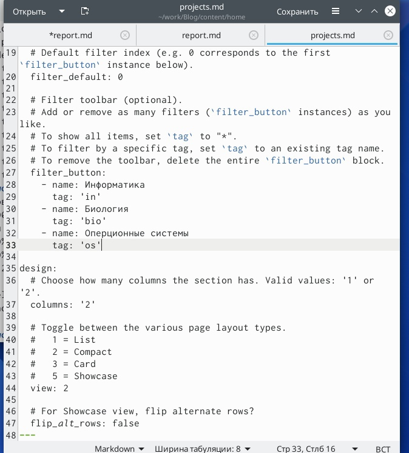
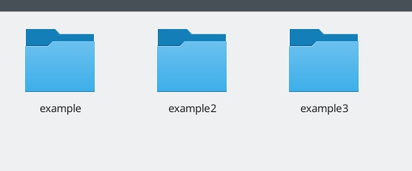
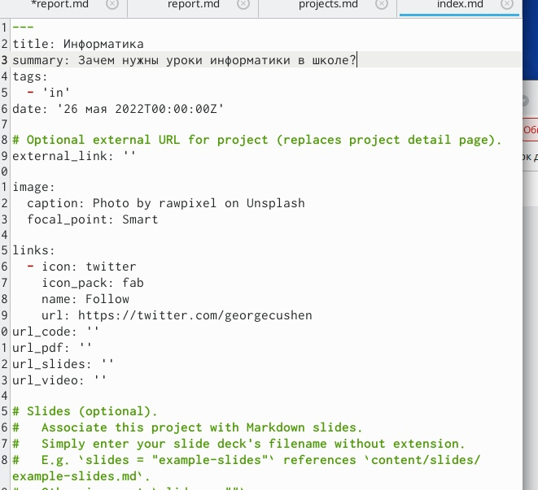
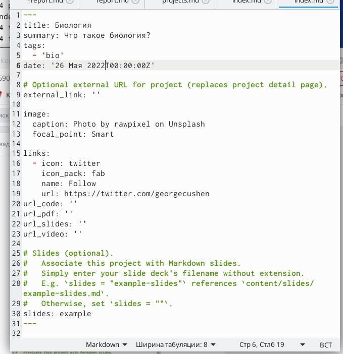
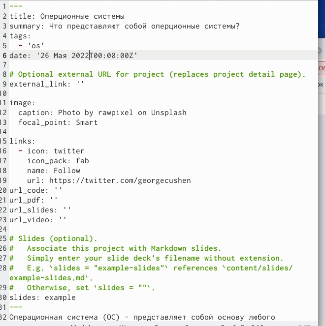
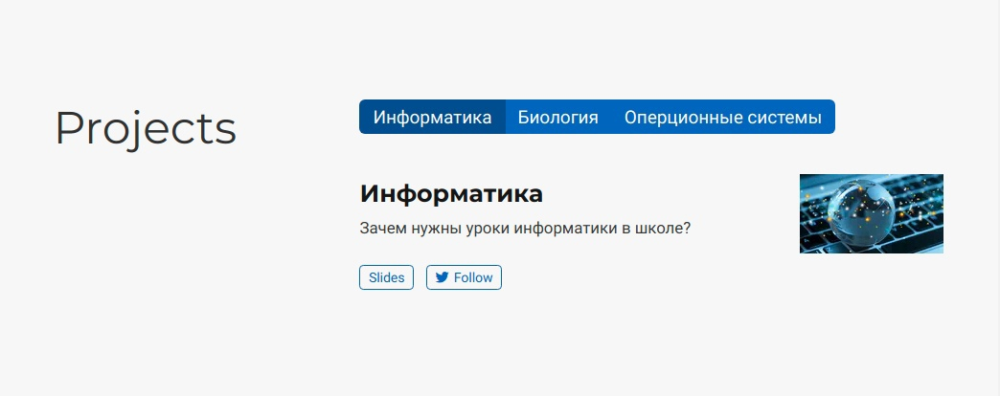
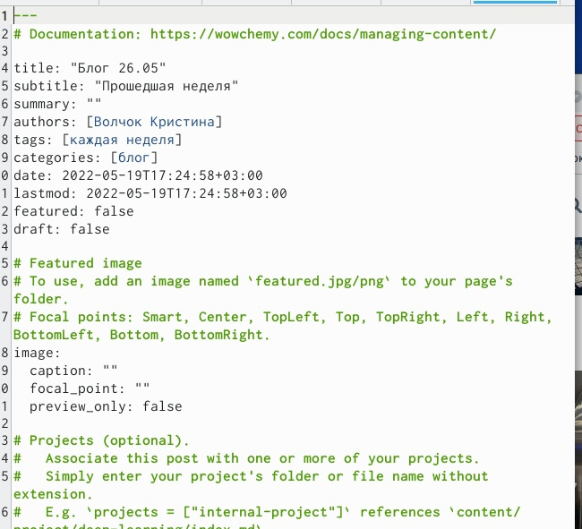
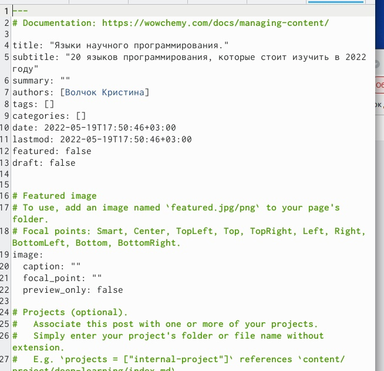
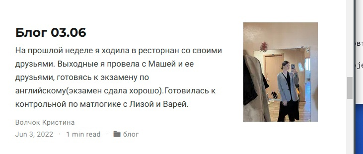

---
## Front matter
title: "Отчёт по выполнению индивидуального проекта (6 этап)."
subtitle: "Дисциплина: Операционные системы"
author: "Волчок Кристина Александровна"

## Generic otions
lang: ru-RU
toc-title: "Содержание"

## Bibliography
bibliography: bib/cite.bib
csl: pandoc/csl/gost-r-7-0-5-2008-numeric.csl

## Pdf output format
toc: true # Table of contents
toc-depth: 2
lof: true # List of figures
fontsize: 12pt
linestretch: 1.5
papersize: a4
documentclass: scrreprt
## I18n polyglossia
polyglossia-lang:
  name: russian
  options:
	- spelling=modern
	- babelshorthands=true
polyglossia-otherlangs:
  name: english
## I18n babel
babel-lang: russian
babel-otherlangs: english
## Fonts
mainfont: PT Serif
romanfont: PT Serif
sansfont: PT Sans
monofont: PT Mono
mainfontoptions: Ligatures=TeX
romanfontoptions: Ligatures=TeX
sansfontoptions: Ligatures=TeX,Scale=MatchLowercase
monofontoptions: Scale=MatchLowercase,Scale=0.9
## Biblatex
biblatex: true
biblio-style: "gost-numeric"
biblatexoptions:
  - parentracker=true
  - backend=biber
  - hyperref=auto
  - language=auto
  - autolang=other*
  - citestyle=gost-numeric
## Pandoc-crossref LaTeX customization
figureTitle: "Рис."
tableTitle: "Таблица"
listingTitle: "Листинг"
lofTitle: "Список иллюстраций"
lolTitle: "Листинги"
## Misc options
indent: true
header-includes:
  - \usepackage{indentfirst}
  - \usepackage{float} # keep figures where there are in the text
  - \floatplacement{figure}{H} # keep figures where there are in the text
---

# Цель работы
 В ходе выполнения данного этапа индивидуального проекта мы должны сделать наш двуязычным. А также добавить посты по прошедшей неделе и на тему по выбору.

# Задание

- Сделать записи для персональных проектов.
- Сделать пост по прошедшей неделе.
- Добавить пост на тему по выбору.

# Выполнение индивидуального проекта 

Начинаю редактирование файла  projects.md (рис. [-@fig:001])

{ #fig:001 width=70% }

Создаем папки, чтобы в последущем продолжить редактирование уже конкретных файлов для записи персональных проектов (рис. [-@fig:002])

{ #fig:002 width=70% }

Редактируем наши md файлы на  тему, которую нам нужно(добавляя при этом конкретные теги).(рис. [-@fig:003])(рис. [-@fig:004])(рис. [-@fig:005])

{ #fig:003 width=70% }

{ #fig:004 width=70% }

{ #fig:005 width=70% }

Перехожу по ссылке, сгенерированной с помощью команды ~/bin/hugo server, здесь с нашим сайтом будут происходить все первоначальные изменения (после каждого вызова команды ~/bin/hugo server). Посмотрим, что изменилось (рис. [-@fig:006])

{ #fig:006 width=70% }

В терминале с помощью команды hugo создаю новый текстовый документ
post7.md в папке post и начинаю его редактирование(рис. [-@fig:007])

{ #fig:007 width=70% }

В терминале с помощью команды hugo создаю новый текстовый документ
post8.md в папке post и начинаю его редактирование(рис. [-@fig:008])

{ #fig:008 width=70% }

Перехожу по ссылке, сгенерированной с помощью команды ~/bin/hugo server, здесь с нашим сайтом будут происходить все первоначальные изменения (после каждого вызова команды ~/bin/hugo server). Посмотрим, что изменилось (рис. [-@fig:009])(рис. [-@fig:0010])

{ #fig:009 width=70% }

{ #fig:0010 width=70% }

# Выводы

 В ходе выполнения данного этапа индивидуального проекта я научилась делать сайт двуязычным. А также добавила посты по прошедшей неделе и на тему по выбору.

